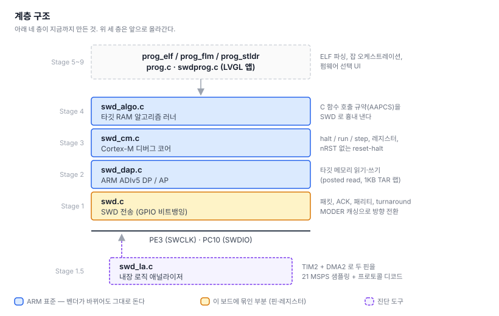

# 2. 타깃 메모리 읽고 쓰기 (ADIv5 DP/AP)

> SWD 오프라인 다운로더 만들기 — [전체 목차](README.md)

[1편](01-swd-transport.md)에서 링크를 맺어 타깃의 DPIDR 을 읽었다. 이제 그 위에
**메모리 접근**을 얹는다. ARM 이 정한 ADIv5 라는 규격이고, 이 계층부터는 벤더와
무관하다.

---

## 3. 계층 쌓기



**아래 한 층만 이 보드에 묶여 있고 나머지는 ARM 표준이다.** `swd.c`는 PE3/PC10과
STM32의 GPIO 레지스터를 직접 다루지만, 그 위의 DP/AP·디버그 코어·알고리즘 러너는
ARM이 정한 규격이라 ST든 Nordic이든 NXP든 같은 코드가 돈다.

이게 나중에 "다른 제조사 MCU 지원"이 거의 공짜가 되는 이유다. 벤더가 늘어도
바뀌는 건 디바이스 ID를 어디서 읽느냐 정도고, 플래시를 굽는 절차 자체는
`.FLM` 파일 안에 들어있다.

### 첫 성공 — DPIDR

링크가 붙었는지는 DP의 ID 레지스터를 읽어 확인한다.

```
cli# swd connect
DPIDR    : 0x2BA01477
  DESIGNER : 0x23B (ARM)
  VERSION  : 1 (DPv1)
  PARTNO   : 0xBA
connect  : OK (952 KHz)
```

`0x23B`는 ARM의 JEP106 코드다. 표준 Cortex-M3/M4용 SW-DP가 맞다.

### 함정 1 — AP 읽기는 posted 다

메모리를 읽으려면 MEM-AP의 `DRW` 레지스터를 읽는데, **요청한 자리에서 값이 나오지
않는다.** 다음 AP 읽기나 DP의 `RDBUFF`에서 나온다.

```
32비트 하나 읽기:
  CSW 설정 → TAR = 주소 → AP read DRW (버림) → DP read RDBUFF (진짜 값)
```

이걸 빠뜨리면 **모든 워드가 한 칸씩 밀린 채로 멀쩡해 보이는 값**이 나온다.
그래서 블록 읽기는 첫 결과를 버려 파이프라인을 채우고 마지막을 `RDBUFF`에서 받는다.
n워드에 n+1 트랜잭션이 든다.

### 함정 2 — 1KB 경계

TAR(주소 레지스터)의 자동 증가는 **1KB 경계에서 되감긴다.** 경계를 넘겨 블록 전송을
걸면 1KB마다 조용히 엉뚱한 주소를 읽거나 쓴다.

```c
while (count > 0)
{
  uint32_t room  = (0x400 - (addr & 0x3FF)) / 4;   // 경계까지 남은 워드
  uint32_t chunk = (count < room) ? count : room;
  ...
}
```

증상이 "플래시가 가끔 이상하다"로 나타나서 원인을 찾기가 가장 나쁜 부류다.
검증용 명령을 따로 만들어 1KB 경계를 세 번 걸치는 3KB를 쓰고 되읽어 비교한다.

```
cli# swd tartest 0x20010000
tartest : 2000FE00 ~ 200109FC (768 word), mismatch 0 -> PASS
```

### 메모리가 읽힌다

```
cli# swd md 0x08000000 4
08000000 : 20020000 08033E71 08033D65 08033D67
```

첫 워드 `0x20020000`은 SRAM 최상단 = **초기 스택 포인터**, 둘째 `0x08033E71`은
bit0이 선 플래시 주소 = **Thumb 모드 리셋 핸들러**. 교과서적인 벡터 테이블이다.
이게 보이면 MEM-AP는 확정이다.

---

---

## 다음

[3. 코어를 세우고 레지스터 만지기](03-debug-core.md) — 메모리가 읽히면 그 다음은
코어 자체를 멈추고 되살리는 것이다.
