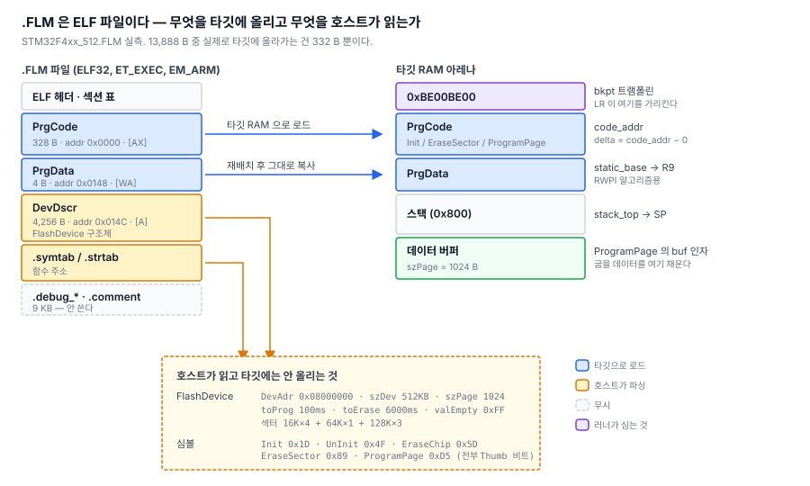

# 5. 플래시 알고리즘을 어디서 구하나

> SWD 오프라인 다운로더 만들기 — [전체 목차](README.md)

[1~4편](README.md)에서 선 두 가닥으로 타깃 MCU를 세우고, 메모리를 읽고 쓰고,
RAM 에 올린 함수를 호출하는 데까지 갔다. 이제 실제로 **플래시를 구울 차례**인데, 여기서 근본적인 질문이 하나 나온다.

**STM32F4의 플래시를 지우고 쓰는 절차를 내가 직접 구현해야 하나?**

`FLASH->KEYR`에 언락 시퀀스를 쓰고, `CR`에 섹터 번호를 넣고, `SR`을 폴링하고…
패밀리마다 다르고 벤더마다 다르다. F1, F4, H7, G0, L4가 전부 다르고 Nordic이나
NXP는 아예 다른 세상이다. 지원 칩을 하나 늘릴 때마다 코드를 짜야 한다면 이 프로젝트는
거기서 끝난다.

---

## 1. 이미 표준이 있다

ARM이 이걸 위해 만들어 둔 게 **CMSIS-Pack의 플래시 알고리즘**, 확장자 `.FLM`이다.

발상이 단순하다. **플래시를 굽는 코드를 타깃 자신의 RAM에 올려서 실행시킨다.**
그러면 호스트는 플래시 컨트롤러를 몰라도 된다. 알아야 할 건 "함수를 어떻게
호출하는가" 하나뿐이고, 그건 [4편](04-algo-runner.md)에서 이미 만들었다.

인터페이스는 이렇게 통일되어 있다.

```c
int Init(uint32_t adr, uint32_t clk, uint32_t fnc);   // fnc: 1=지우기 2=쓰기 3=검증
int UnInit(uint32_t fnc);
int EraseSector(uint32_t adr);
int EraseChip(void);
int ProgramPage(uint32_t adr, uint32_t sz, uint8_t *buf);
```

거의 모든 Cortex-M에 대해 벤더가 배포한다. pyOCD, Keil MDK, probe-rs가 전부 이걸 쓴다.

ST는 여기에 더해 **External Loader(`.stldr`)**라는 걸 따로 주는데, QSPI/OSPI 같은
외부 메모리용이다. 둘 다 ELF 파일이라 파서를 공유할 수 있다.

## 2. 파일 구하기

`pyocd`가 CMSIS-Pack 인덱스를 관리해준다.

```
$ pyocd pack --update
$ pyocd pack --find stm32f411
  Part            Vendor               Pack                 Version   Installed
  STM32F411RETx   STMicroelectronics   Keil.STM32F4xx_DFP   3.1.1     True
```

받은 팩은 ZIP이고, 안에 `.FLM` 20개가 들어 있다.

```
CMSIS/Flash/STM32F4xx_512.FLM      ← 512KB 플래시용
CMSIS/Flash/STM32F4xx_1024.FLM
CMSIS/Flash/STM32F411xx_OPT.FLM    ← 옵션 바이트용
CMSIS/Flash/STM32F4xx_OTP.FLM
...
```

같이 들어있는 `.pdsc`(XML)에는 디바이스 정의가 있다. 우리 타깃인 F411RE를 찾아보면:

```
STM32F411RE   Cortex-M4 @ 100MHz
  Flash  0x08000000  512KB   (default)
  SRAM   0x20000000  128KB   (default)
  algo   CMSIS/Flash/STM32F4xx_512.FLM   (default)
```

**앞에서 SWD로 칩에서 직접 읽은 값과 정확히 일치한다.** DBGMCU가 알려준 DEV_ID
`0x431`, 플래시 크기 레지스터가 알려준 512KB, 벡터 테이블의 초기 SP `0x20020000`
(= 128KB SRAM 최상단). 서로 다른 두 경로에서 온 정보가 맞아떨어지는 건 기분 좋은
확인이다.

## 3. .FLM을 열어보다

C로 파서를 쓰기 전에 **PC에서 먼저 열어봤다.** 계획서에 적어둔 구조체 오프셋이
실제 파일과 맞는지 확인하지 않고 펌웨어에 파서를 넣으면, 나중에 실패했을 때
"파서 버그인지 문서가 틀린 건지" 구분이 안 된다.

파이썬으로 ELF 헤더부터 훑어보니 이렇게 나왔다.

```
파일        : STM32F4xx_512.FLM  (13,888 bytes)
e_type      : 2 (EXEC)   e_machine: 40 (ARM)

--- 섹션 ---
  PrgCode          PROGBITS  addr 0x00000000 size 0x000148 [AX]
  PrgData          PROGBITS  addr 0x00000148 size 0x000004 [WA]
  DevDscr          PROGBITS  addr 0x0000014C size 0x0010A0 [A]
  .debug_* 등 나머지

--- 심볼 ---
  Init           0x0000001D   FUNC   ← Thumb 비트
  UnInit         0x0000004F   FUNC   ← Thumb 비트
  EraseChip      0x0000005D   FUNC   ← Thumb 비트
  EraseSector    0x00000089   FUNC   ← Thumb 비트
  ProgramPage    0x000000D5   FUNC   ← Thumb 비트
  누락: Verify, BlankCheck            ← 선택 사항이라 없어도 된다

--- FlashDevice ---
  DevName   : STM32F4xx 512kB Flash
  DevAdr    : 0x08000000      szDev : 512 KB      szPage : 1024
  toProg    : 100 ms          toErase : 6000 ms   valEmpty : 0xFF
  sectors   :  16384 B @ +0x00000000
               65536 B @ +0x00010000
              131072 B @ +0x00020000
```

**문서에 적어둔 구조체 오프셋이 전부 맞았다.** `Vers`가 2바이트, `DevName`이 128바이트,
`DevAdr`이 오프셋 132, 섹터 배열이 160부터 — 하나도 안 틀렸다.

섹터 배열이 재밌는데, `(크기, 시작오프셋)` 쌍이고 **다음 항목이 나올 때까지 그 크기가
유지된다.** 그러니까 위 세 줄은:

```
16KB × 4개    +0x00000 ~ +0x0FFFF   (섹터 0~3)
64KB × 1개    +0x10000 ~ +0x1FFFF   (섹터 4)
128KB × 3개   +0x20000 ~ +0x7FFFF   (섹터 5~7)
                              합계 512KB
```

F411RE의 실제 플래시 배치 그대로다.

## 4. 무엇을 타깃에 올리고 무엇을 호스트가 읽는가

여기가 이번 편의 핵심이다.



13,888바이트짜리 파일인데 **실제로 타깃 RAM에 올라가는 건 332바이트뿐이다.**

- **`PrgCode` (328 B)** — 진짜 실행 코드. 타깃으로 간다.
- **`PrgData` (4 B)** — 데이터. 타깃으로 간다. 이 주소가 `R9`(static base)가 된다.
- **`DevDscr` (4,256 B)** — `FlashDevice` 구조체. **호스트가 읽는 메타데이터**다.
  섹터 크기, 페이지 크기, 타임아웃이 여기 들어있다. 타깃에는 안 올린다.
- **`.symtab` / `.strtab`** — 함수 주소를 찾는 데 쓴다. 역시 호스트 전용.
- **`.debug_*` (9 KB)** — 디버그 정보. 그냥 무시한다.

즉 파일의 3분의 2가 우리한테는 읽고 버리는 정보다. `PrgCode`가 328바이트라는 것도
인상적인데, 플래시를 지우고 쓰는 절차 전체가 그 안에 들어간다.

### 재배치

`PrgCode`가 주소 `0x00000000`에 링크되어 있다. 타깃 RAM은 `0x20000000`대이니
그대로 올릴 수 없고 **재배치**해야 한다.

`.FLM`은 ROPI(위치 독립 코드)로 빌드되어 있어서, 내부 배치만 유지하면 어디에 올려도
돈다. 그래서 `delta = 실제로 올릴 주소 - 파일에서 가장 낮은 주소`를 구해서 모든
섹션과 함수 주소에 더하면 된다.

`.stldr`은 정반대다. **절대 주소로 링크되어 있어서 재배치하면 안 되고** 파일이 지정한
자리에 그대로 올려야 한다. 이 둘을 뒤바꾸면 `Init()` 안에서 하드폴트가 나는데 아무
진단도 안 나온다.

| | `.FLM` | `.stldr` |
|---|---|---|
| 링크 주소 | ROPI, 재배치 | **고정, 그대로** |
| 성공 반환값 | `0` | `1` |
| 섹터 배열 | `(크기, 오프셋)` | `(개수, 크기)` |
| `Init()` 인자 | `(adr, clk, fnc)` | `(void)` |

성공 반환값이 반대인 것도 함정이다. 호출부에 `if (ret == 0)`을 흩어놓으면 나중에
`.stldr`을 붙일 때 전부 뒤집어야 한다. 극성은 알고리즘 vtable에 숨기기로 했다.

## 5. SD카드 배치

파일을 보드에 올렸다. SD카드에는 이미 `/wav`, `/doom`, `/ui` 같은 다른 앱의 폴더가
있어서, 다운로더 관련은 **루트 하나 아래로** 모았다.

```
/prog/
  mcu/
    stm32f4.txt              디바이스 정의 (이 폴더의 *.txt 를 전부 읽는다)
  loaders/
    STM32F4xx_512.FLM        플래시 알고리즘
  fw/
    f411_test/
      fw.txt                 무엇을 어디에 구울지
      app.bin
```

경로는 `hw_def.h`의 `HW_SWD_SD_ROOT` 하나만 바꾸면 전부 따라온다.

```c
#define HW_SWD_SD_ROOT      "/prog"
#define HW_SWD_SD_MCU       HW_SWD_SD_ROOT "/mcu"
#define HW_SWD_SD_LOADERS   HW_SWD_SD_ROOT "/loaders"
#define HW_SWD_SD_FW        HW_SWD_SD_ROOT "/fw"
```

`mcu/`를 파일 하나가 아니라 폴더로 둔 건 벤더별로 쪼갤 수 있게 하기 위해서다.
나중에 `nordic.txt`, `nxp.txt`가 늘어나도 구조가 안 바뀐다.

디바이스 정의는 이렇게 생겼다.

```ini
[STM32F411RE]
id_addr = 0xE0042000        # 어느 주소를 읽어서
id_mask = 0x00000FFF        # 어느 비트가
id_val  = 0x00000431        # 이 값이면 이 칩이다
ram     = 0x20000000
ram_sz  = 0x20000
algo    = /prog/loaders/STM32F4xx_512.FLM
```

`id_addr`을 하드코딩하지 않고 데이터로 뺀 게 중요하다. ST는 DBGMCU_IDCODE를 쓰지만
패밀리마다 주소가 다르고(F4는 `0xE0042000`, H7은 `0x5C001000`, G0는 `0x40015800`),
Nordic은 FICR, Microchip은 DSU를 쓴다. **"어느 주소를 읽어 어느 비트가 무엇이면
이 칩"이라고만 적어두면 벤더가 늘어도 코드는 그대로다.**

파일 전송은 기존 USB CDC 프로토콜을 그대로 썼다. 보드에 이미 있던 기능이라
새로 만들 게 없었다.

```
$ python3 tools/python/upload.py -d sd STM32F4xx_512.FLM /prog/loaders/STM32F4xx_512.FLM
  /prog/loaders/STM32F4xx_512.FLM    OK   13888 B   0.1s   191.8 KB/s
```

## 다음

[6. ELF 파서를 펌웨어에 넣기](06-elf-loader.md) — 준비는 끝났다. 이제 펌웨어가 이
파일을 직접 읽어 타깃 RAM 에 올린다.
