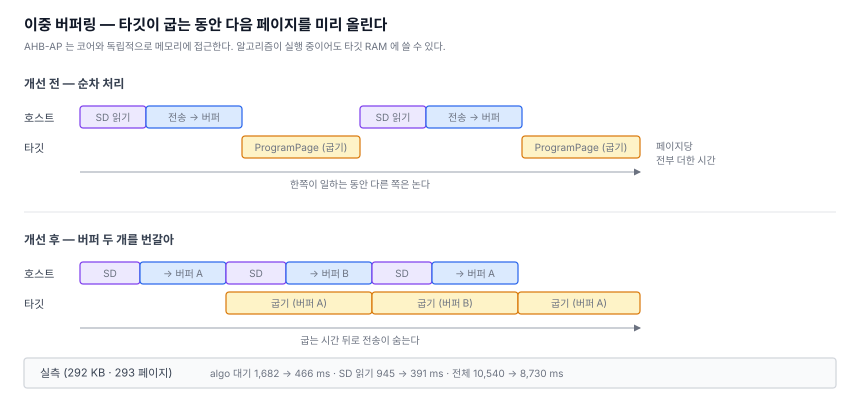

# 8. 얼마나 빠른가 — 그리고 병목을 두 번 잘못 짚었다

> SWD 오프라인 다운로더 만들기 — [전체 목차](README.md)

[7편](07-first-burn.md)에서 292KB 를 굽고 검증하는 데 성공했다. 20.7초 걸렸다.
빠른 건지 느린 건지 모르니 **같은 칩에 다른 도구로도 구워봤다.**

ST-LINK 를 F411 보드에 옮겨 물리고 측정했다.

---

## 1. 기준점

| 도구 | 굽기 | 검증 | 합계 |
|---|---|---|---|
| ST CubeProgrammer (4 MHz) | 5.85 s | 1.99 s | **7.84 s** |
| pyOCD (4 MHz) | 21.8 s | 포함 | 21.8 s |
| pyOCD (기본) | 28.3 s | 포함 | 28.3 s |

의외였다. **pyOCD 가 우리보다 느리다.** 같은 ST-LINK 를 쓰는데도 그렇다.

이유는 USB 왕복이다. 프로브에 명령 하나 보내고 응답 받는 데 1ms 안팎이 드는데,
그게 수만 번 쌓인다. 우리는 GPIO 를 직접 흔들기 때문에 그 비용이 아예 없다.

**검증은 우리가 ST 도구보다도 빠르다** (1.5 s vs 2.0 s). 되읽기는 순수하게
연속 전송이라 USB 왕복이 그대로 손해로 나타난다.

## 2. 첫 번째 오판 — "플래시 쓰기 시간이 지배한다"

처음 측정했을 때 나는 이렇게 정리했다.

> 굽기가 검증보다 3배 느린 건 타깃의 플래시 쓰기 시간이 지배하기 때문이다.
> SWD 속도를 올려도 굽기 시간은 거의 안 줄어든다.

그럴듯했고, 실제로 SWD 속도를 1 MHz 에서 3.5 MHz 로 올렸을 때 15.1s → 10.6s 로
기대만큼 안 줄어든 것도 이 설명과 맞았다.

**그런데 ST 도구가 같은 칩에 5.85 초에 끝냈다.** 플래시 물리 시간이 지배한다면
ST 도 그만큼 걸려야 한다. 설명이 틀린 것이다.

## 3. 두 번째 오판 — "폴링 granularity가 범인"

다음 가설은 이랬다. 알고리즘 완료를 기다리는 루프가 `delay(1)` 로 폴링하는데,
FreeRTOS 틱 단위라 실제로는 1~2ms 씩 잡아먹는다. 페이지 하나 굽는 데 4ms 밖에
안 걸리는데 대기가 그만큼이면 절반이 낭비다 — 그럴듯했다.

고쳤다. 결과는 **10,653 → 10,500 ms. 150ms.**

## 4. 그래서 계측했다

추측을 멈추고 단계별로 시간을 쟀다.

```
전체     : 10,540 ms
  erase   :  6,544 ms   62%
  algo    :  1,682 ms   16%
  xfer    :  1,364 ms   13%
  sd read :    945 ms    9%
```

**소거가 62%였다.** 알고리즘 호출 전체가 1.68초뿐이니 폴링을 아무리 고쳐도
150ms 밖에 안 나오는 게 당연했다.

두 번 다 그럴듯한 가설이었고 두 번 다 틀렸다. **계측 한 번이 추론 두 번보다
나았다.**

## 5. 겹칠 수 있는 것을 겹친다

소거 6.5초는 타깃이 쓰는 시간이라 손댈 수 없다. 남은 4.0초(algo + xfer + read)는
겹칠 수 있다.



근거는 **AHB-AP 가 코어와 독립적으로 메모리에 접근한다**는 점이다. 알고리즘이
실행 중이어도 타깃 RAM 에 쓸 수 있다. 그래서 동기 호출을 시작과 대기로 쪼갰다.

```c
swdAlgoStart(ctx, pc, r0, r1, r2, r3);   // 시작만 하고 안 기다린다
  ... 다음 페이지를 SD 에서 읽어 다른 버퍼로 전송 ...
swdAlgoWait(ctx, timeout, &ret);          // 그제서야 거둔다
```

결과:

```
              이전       이후
  전체     10,540  →   8,730 ms   (-17%)
  erase     6,544  →   6,517      변화 없음
  algo      1,682  →     466      전송 뒤로 숨었다
  sd read     945  →     391
  xfer      1,364  →   1,352
```

## 6. 남은 격차는 전부 소거였다

| | 굽기 | 검증 | 합계 |
|---|---|---|---|
| ST CubeProgrammer | 5.85 s | 1.99 s | 7.84 s |
| **우리 (개선 후)** | **8.73 s** | **1.48 s** | **10.21 s** |
| pyOCD (4 MHz) | 21.8 s | 포함 | 21.8 s |

소거를 빼면 우리 굽기는 2.2초, ST 는 약 1.9초로 사실상 같다. **차이는 전부
소거 6.5초 대 약 4초에서 온다.**

`.FLM` 의 코드가 328 바이트뿐이라 직접 뜯어봤다.

```asm
EraseSector:
  98:  movs r4, #2
  9a:  str  r4, [r1, #16]     → FLASH->CR = 0x002
                                bit1 SER, PSIZE(9:8) = 00 = x8    ← 느리다

ProgramPage:
  ea:  ldr  r3, =0x00000201
  f0:  orrs r4, r3
  f2:  str  r4, [r5, #16]     → FLASH->CR |= 0x201
                                bit0 PG, PSIZE(9:8) = 10 = x32    ← 빠르다
```

**같은 알고리즘이 굽기는 x32 로 하면서 소거는 x8 로 한다.** STM32F4 에서 PSIZE
(프로그램 병렬도)는 소거 시간에도 직결되고, x8 과 x32 는 2~3배 차이가 난다.

ST 자체 도구는 자기 플래시 드라이버를 쓰니 VDD 3.22V 를 보고 x32 로 소거했을
것이다. `.FLM` 은 전압을 모르니 보수적으로 잡은 것으로 보인다.

**표준 인터페이스로는 손댈 수 없다.** `Init(adr, clk, fnc)` 에 병렬도를 알릴
통로가 없고, 알고리즘이 `CR` 을 통째로 덮어쓴다. 우회하려면 RAM 에 올라간 코드를
패치하거나 패밀리별 소거 루틴을 따로 만들어야 하는데, 그건 **`.FLM` 을 쓰는 이유
자체를 무너뜨린다** — 벤더가 늘 때마다 코드를 추가해야 한다.

2.4초를 위해 그 대가를 치를 이유는 없다고 판단했다.

> 덧붙여, `Init` 을 읽다가 알게 된 것 하나. 워치독이 하드웨어 모드면 최장
> 타임아웃으로 재설정한다(`IWDG->PR=6, RLR=0xFFF`). 긴 소거 중에 워치독 리셋이
> 걸리는 걸 막으려는 것이다. 잘 만들어진 알고리즘이다.

## 7. 정리

- **pyOCD 보다 2.1배 빠르다.** USB 왕복이 없는 게 크다.
- **ST 공식 도구보다 1.3배 느리다.** 그 차이는 전부 소거 병렬도에서 온다.
- 소거를 제외한 구간은 ST 와 대등하다.

그리고 이번 편의 진짜 교훈은 성능이 아니다. **그럴듯한 가설 두 개가 연달아
틀렸고, 단계별 계측 한 번이 그걸 5분 만에 정리했다.** 최적화는 재고 나서 하는
것이다.

## 다음

이제 굽는 것 자체는 된다. 남은 건 쓰기 좋게 만드는 일이다 — 펌웨어 파일 형식을
`.bin` 말고 `.elf` 와 Intel HEX 까지 받고, 어느 파일을 어디에 굽는지 적어두는
설정 파일을 읽고, 마지막으로 화면에서 고를 수 있게 하는 것.
