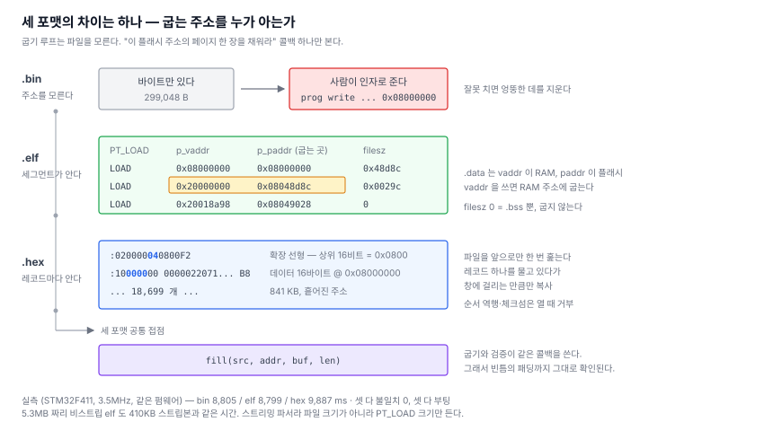

# 9. 펌웨어 파일 세 가지 — 그리고 주소는 어디서 오나

> SWD 오프라인 다운로더 만들기 — [전체 목차](README.md)

[8편](08-performance.md)까지 `.bin` 을 굽는다. 실제로 쓰려면 `.elf` 와 Intel HEX
도 받아야 한다.

세 포맷의 차이는 결국 **"어디에 굽는지를 누가 아느냐"** 하나다.



---

## 1. 굽기 루프에서 파일을 떼어낸다

`.bin` 전용으로 짜여 있던 이중 버퍼 루프에 포맷 분기를 넣으면 세 벌이 된다.
접점을 하나로 줄였다.

```c
/* 이 플래시 주소의 페이지 한 장을 채워라.
   소스에 그 범위 데이터가 없으면 val_empty 로 채워서라도 len 을 다 채운다. */
typedef bool (*flm_fill_t)(void *src, uint32_t addr, uint8_t *p_buf, uint32_t len);
```

이제 `flmProgramRange()` 는 파일을 모른다. 검증도 같은 콜백을 쓰기 때문에
**패딩과 빈틈까지 굽은 그대로 확인**되고, SD 읽기가 깨진 경우도 걸린다.

## 2. `.elf` — vaddr 을 쓰면 RAM 에 굽는다

ELF 는 이미 [6편](06-elf-loader.md)에서 `.FLM` 을 읽으려고 파서를 만들어뒀다.
`PT_LOAD` 세그먼트를 순회하면 끝 — 이라고 생각했는데 함정이 하나 있다.

F411 펌웨어의 세그먼트다.

```
Type  Offset    VirtAddr    PhysAddr    FileSiz   MemSiz
LOAD  0x001000  0x08000000  0x08000000  0x48d8c   0x48d8c   R E
LOAD  0x04a000  0x20000000  0x08048d8c  0x0029c   0x18a98   RW
LOAD  0x000a98  0x20018a98  0x08049028  0x00000   0x00600   RW
```

두 번째 세그먼트는 **`p_vaddr` 이 RAM(`0x20000000`)이고 `p_paddr` 이 플래시**
(`0x08048d8c`)다. `.data` 다 — 실행 중에는 RAM 에 있지만, 전원이 꺼진 동안
보관되는 곳은 플래시다.

**굽는 주소는 `p_paddr`(LMA)이다.** `p_vaddr` 을 쓰면 RAM 주소를 플래시에
굽겠다고 덤빈다. 세 번째는 `filesz == 0` — `.bss` 뿐이라 굽지 않는다.

```c
if (ph.type != ELF_PT_LOAD) continue;
if (ph.filesz == 0)         continue;
if (ph.paddr < lo)             lo = ph.paddr;
if (ph.paddr + ph.filesz > hi) hi = ph.paddr + ph.filesz;
```

`0x08000000 ~ 0x08049028` = **299,048 바이트**. `objcopy -O binary` 로 뽑은
`.bin` 크기와 정확히 같다. 계산이 맞다는 좋은 확인이다.

세그먼트 사이 빈틈은 소거값으로 채운다. 그 구간도 어차피 지웠으니 되읽으면
일치한다.

```
cli# prog write /prog/loaders/STM32F4xx_512.FLM /prog/fw/f411_lcd/app.elf 0x20001000
algo   : STM32F4xx 512kB Flash
image  : /prog/fw/f411_lcd/app.elf (elf, 주소는 파일 안에)
write  : OK  0x08000000, 299048 bytes, 8799 ms
verify : OK  불일치 0, 1556 ms  -> PASS
```

**주소 인자가 없다.** 파일이 스스로 어디로 갈지 안다.

디버그 정보를 안 뗀 **5.3MB 짜리 원본으로도 같은 시간**이 나온다. 스트리밍
파서라 파일 크기가 아니라 `PT_LOAD` 크기만 시간에 들어간다.

## 3. Intel HEX — 스트리밍이 되는가

HEX 는 텍스트다.

```
:020000040800F2                     확장 선형 주소: 상위 16비트 = 0x0800
:1000000000000220713E0308653D0308673D0308B8
 │ │    │ │                                └ 체크섬
 │ │    │ └ 데이터 16바이트
 │ │    └ 타입 00 = 데이터
 │ └ 하위 주소 0x0000
 └ 길이 0x10
```

문제는 **주소가 레코드마다 흩어져 있다**는 것이다. 841KB 파일에 18,699개.
페이지 하나를 채우려고 매번 파일을 뒤지면 O(n²)라 답이 없고, 전부 펼치면
299KB 를 RAM 에 올려야 한다.

해법은 페이지가 **낮은 주소부터 차례로** 요청된다는 성질이다. 파일을 앞으로만
한 번 훑으면서, 레코드 하나를 손에 물고 있다가 지금 창에 걸리는 만큼만 복사한다.

```c
if (rec_end <= addr)          { rec_valid = false; continue; }  // 창보다 앞 — 버린다
if (rec_addr >= win_end)        break;                          // 창보다 뒤 — 물고 있는다
memcpy(...겹치는 만큼...);
if (rec_end > win_end)          break;                          // 걸쳐 있다 — 물고 있는다
rec_valid = false;
```

레코드가 페이지 경계에 걸쳐도 되고, 파일 전체를 정확히 한 번만 읽는다.

### 대신 순서를 가정한다 — 그래서 미리 확인한다

이 방식은 **레코드가 주소 오름차순**이어야 성립한다. 컴파일러가 뱉는 hex 는 늘
그렇지만, 손으로 이어 붙인 파일은 아닐 수 있다.

그래서 **열 때 파일 전체를 한 번 스캔**한다. 체크섬, 주소 역행, 빈 파일을 여기서
다 본다.

이게 중요한 이유는 순서가 아니라 **시점**이다. 굽는 도중에 파일이 이상한 걸
알게 되면 이미 지운 뒤라 손쓸 방법이 없다.

```
cli# prog write ... /prog/fw/f411_lcd/bad.hex 0x20001000    (체크섬 한 글자 훼손)
write  : PROTOCOL  0 bytes, 105 ms
  erase   :     0 ms          ← 지우기 전에 멈췄다

cli# prog write ... /prog/fw/f411_lcd/bado.hex 0x20001000   (주소 역행)
write  : PROTOCOL  0 bytes, 188 ms
  erase   :     0 ms

cli# swd md 0x08000000 4
08000000 : 20020000 08033E71 08033D65 08033D67    ← 타깃은 멀쩡하다
```

### `f_gets` 를 쓰면 안 된다

FatFs 의 `f_gets` 는 **한 글자씩 `f_read` 를 부른다.** 18,699줄 × 평균 45자면
84만 번의 호출이다. 512바이트씩 읽어 직접 줄을 끊는다.

```
cli# prog write /prog/loaders/STM32F4xx_512.FLM /prog/fw/f411_lcd/app.hex 0x20001000
image  : /prog/fw/f411_lcd/app.hex (hex, 주소는 파일 안에)
write  : OK  0x08000000, 299048 bytes, 9887 ms
  sd read :  1141 ms
verify : OK  불일치 0, 2210 ms  -> PASS
```

SD 읽기가 `.bin`(425 ms)보다 2.7배 걸린다. 텍스트라 파일이 2.8배 크고 파싱도
해야 하니 당연한 값이다. 전체로는 8.8초 → 9.9초.

## 4. 같은 펌웨어인데 결과가 다르다

`prog hex info` 가 알려주는 것 중 하나가 눈에 걸렸다.

```
cli# prog hex info /prog/fw/f411_lcd/app.hex
records  : 18699
range    : 0x08000000 ~ 0x08049027  (299048 bytes)
data     : 299016 bytes  (빈틈 32)
entry    : 0x08033E71
```

**32 바이트가 어떤 레코드에도 없다.** 벡터 테이블과 `.text` 사이 정렬 패딩이다.
`objcopy -O ihex` 는 섹션 단위로 내보내기 때문에 그 사이를 빈칸으로 둔다.

그래서 같은 펌웨어인데 굽고 나면 플래시가 다르다.

```
bin  으로 굽고 : 08000190 : 08033EC1 08033EC1 00000000 00000000
hex  로 굽고   : 08000190 : 08033EC1 08033EC1 FFFFFFFF FFFFFFFF
```

`objcopy -O binary` 는 그 자리를 `0x00` 으로 채우고, hex 는 **아무 말도 하지
않는다.** 우리는 소거값 `0xFF` 로 남긴다.

**hex 쪽이 맞다.** 파일이 지정하지 않은 바이트를 프로그래머가 지어내면 안 된다.
둘 다 검증을 통과하고 둘 다 부팅한다 — 안 쓰는 벡터 슬롯이니까. 하지만 "굽은
내용이 파일과 같은가" 를 바이트로 비교하는 사람은 이걸 알아야 한다. 그래서
`prog hex info` 가 빈틈 크기를 먼저 보여준다.

## 5. 포맷은 확장자로 판단하지 않는다

```c
elfIsElfFile(path)   // 첫 4바이트가 0x7F 'E' 'L' 'F'
hexIsHexFile(path)   // 첫 글자가 ':'
                     // 둘 다 아니면 .bin
```

확장자는 사람이 붙이는 것이라 틀린다. `.bin` 만 주소를 못 알아내므로 그때만
인자를 요구한다.

```
cli# prog write /prog/loaders/STM32F4xx_512.FLM /prog/fw/f411_lcd/app.bin 0x20001000
.bin 은 굽는 주소가 파일에 없다. flash 주소를 지정해라
```

## 6. 세 포맷 실측

같은 F411 펌웨어, 같은 타깃, 3.5 MHz.

| 형식 | 파일 크기 | 굽기 | 검증 | 주소 출처 |
|---|---|---|---|---|
| `.bin` | 299 KB | 8,805 ms | 1,481 ms | 명령 인자 |
| `.elf` (strip) | 410 KB | 8,799 ms | 1,556 ms | `p_paddr` |
| `.elf` (원본) | 5.3 MB | 8,799 ms | 1,556 ms | `p_paddr` |
| `.hex` | 841 KB | 9,887 ms | 2,210 ms | 레코드 |

셋 다 불일치 0 이고 셋 다 굽고 나서 타깃이 부팅했다. 5.3MB 짜리가 410KB 짜리와
같은 시간인 게 스트리밍 파서의 값어치다.

## 다음

이제 세 포맷을 다 굽는다. 남은 건 **어느 파일을 어느 칩에 굽는지**를 사람이
매번 타이핑하지 않게 하는 것 — 디바이스 DB 와 설정 파일, 그리고 화면.
