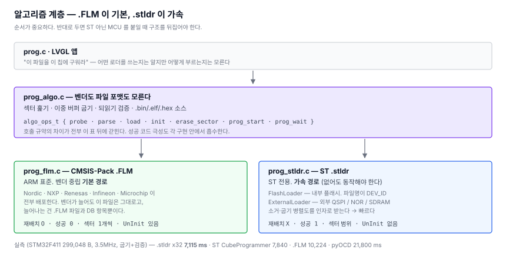

# 10. ST 로더를 빌려 쓰다 — 그리고 공식 도구를 넘다

> SWD 오프라인 다운로더 만들기 — [전체 목차](README.md)

[8편](08-performance.md)은 이렇게 끝났다.

> **표준 인터페이스로는 손댈 수 없다.** `Init(adr, clk, fnc)` 에 병렬도를 알릴
> 통로가 없고 (…) 2.4초를 위해 그 대가를 치를 이유는 없다.

절반만 맞았다. **`.FLM` 인터페이스에는 통로가 없지만, `.stldr` 에는 있다.**

---

## 1. CubeProgrammer 안에 폴더가 두 개 있다

```
STM32CubeProgrammer/bin/
  FlashLoader/      0x431.stldr  0x450.stldr  ...        103개, 3.7MB
  ExternalLoader/   MX25L512G_STM32F723E-DISCO.stldr ...   90개,  27MB
```

둘 다 `.stldr`(ELF32)이고 `StorageInfo` + `Init/Write/SectorErase/Verify` 라는
**같은 인터페이스**를 쓴다. 다른 건 무엇을 굽느냐다.

| | FlashLoader | ExternalLoader |
|---|---|---|
| 파일명 | `0x431.stldr` — **DEV_ID** | `칩_보드.stldr` |
| DeviceType | 전부 `MCU_FLASH` | NOR 70, SRAM 9, NAND 4 … |
| 대상 | `0x08000000` 내부 플래시 | `0x90000000` QSPI, `0xC0000000` SDRAM … |
| 고르는 법 | 타깃에서 읽은 DEV_ID 로 자동 | 보드에 맞춰 사람이 |
| `Init()` | 플래시 unlock + 워치독 연장 | **`SystemInit` — 타깃 클럭을 재설정한다** |

`FlashLoader/0x431.stldr` 을 뜯어보니 이름이 `"0x431"`, 512KB, 섹터
16K×4 / 64K×1 / 128K×3 — **우리가 굽고 있는 F411 내부 플래시 그 자체**다.
CubeProgrammer 가 DBGMCU 에서 DEV_ID 를 읽어 같은 이름의 파일을 집는 구조다.

**그래서 외부 플래시 보드 없이도 오늘 시험할 수 있다.** 이게 순서를 바꾼 이유다.

## 2. 계층을 먼저 나눈다 — ST 가 중심이 되면 안 된다

굽기 코드가 `.FLM` 호출 규약에 직접 붙어 있어서 `.stldr` 을 넣을 자리가 없었다.
넣기 전에 갈랐다.



**순서가 중요하다.** `.FLM` 이 기본이고 `.stldr` 이 선택이다. `.FLM` 은 ARM
표준이라 Nordic·NXP·Renesas·Infineon 이 전부 배포하지만, `.stldr` 은 ST 전용
포맷이다. 반대로 두면 다른 제조사를 붙일 때 구조를 뒤집어야 한다.

`prog_algo.c` 아래로는 **벤더도 파일 포맷도 모른다.** 지울 섹터를 훑고, 조각을
타깃 버퍼로 옮기고, 되읽어 비교하는 것까지가 전부다.

## 3. 같은 인터페이스, 반대인 규칙 네 가지

| | `.FLM` | `.stldr` |
|---|---|---|
| 링크 주소 | ROPI — **재배치한다** | 절대 — **재배치하면 안 된다** |
| 성공 반환 | `0` | `1` |
| 지우기 | `EraseSector(adr)` 한 섹터 | `SectorErase(start, end)` 범위 |
| 굽기 | `ProgramPage(adr, szPage, buf)` | `Write(adr, size, buf)` 임의 길이 |
| `UnInit` | 있다 | **없다** |

재배치를 뒤바꾸면 `Init()` 안에서 하드폴트가 나고 진단이 안 나온다. 성공 극성을
놓치면 **실패를 성공으로 보고한다.** 그래서 극성은 각 구현의 `Call` 래퍼 하나에만
둔다 — [7편](07-first-burn.md)에서 `.FLM` 을 붙일 때 미리 그렇게 해뒀다.

### 섹터 배열은 아예 반대다

```
.FLM     { 크기, 오프셋 }   그 크기가 다음 항목 전까지 유지된다
.stldr   { 개수, 크기   }   런 길이 인코딩
```

파싱 시점에 공통 표현으로 펼쳐 담으면 위쪽은 구분하지 않는다. 확인은 쉬웠다 —
같은 칩의 두 파일이 같은 맵을 내놓아야 한다.

```
cli# prog algo info /prog/loaders/flm/STM32F4xx_512.FLM
kind     : FLM          DevName : STM32F4xx 512kB Flash
sectors  :  16 KB x 4 @ 0x08000000 / 64 KB x 1 @ 0x08010000 / 128 KB x 3 @ 0x08020000

cli# prog algo info /prog/loaders/st/0x431.stldr
kind     : stldr        DevName : 0x431
sectors  :  16 KB x 4 @ 0x08000000 / 64 KB x 1 @ 0x08010000 / 128 KB x 3 @ 0x08020000
```

## 4. 주소 0 에 있는 세그먼트를 올리면 안 된다

`.stldr` 은 절대 주소라 `PT_LOAD` 를 `p_vaddr` 그대로 올린다. 그런데 이런 파일이
많다.

```
Type  VirtAddr    PhysAddr    FileSiz
LOAD  0x00000000  0x00000000  0x000c8     ← 200바이트. StorageInfo 다
LOAD  0x20000004  0x20000004  0x02a5c     ← 진짜 코드
```

첫 세그먼트는 **호스트만 읽는 기술자**인데 `PT_LOAD` 라서, 그대로 올리면
**타깃 주소 0 에 쓰려 든다.** `.FLM` 의 `DevDscr` 과 같은 성격이고, `.FLM` 은
섹션 이름으로 걸러낼 수 있었지만 여기는 이름이 없다.

CubeProgrammer 1.22 기준 FlashLoader 103개 중 70개, ExternalLoader 90개 중
46개가 이렇다. 절반이 넘으니 못 보고 넘어가기도 어렵다.

```c
static bool stldrLoadSegCb(uint32_t addr, const uint8_t *p_data, uint32_t len, void *ctx)
{
  if (addr < 0x1000) return true;       // 호스트용 기술자. 건너뛴다.
  return algoWriteMem(addr, p_data, len, ctx);
}
```

## 5. 그리고 8편의 격차가 풀렸다

ST 로더의 `SectorErase` 를 디스어셈블했다.

```asm
SectorErase(r0=start, r1=end, r2=병렬도)      ← 인자가 셋이다
  ...
  cmp r1,#2 → r6 = 0x200                      PSIZE x32
  bic r0, r0, #0x300                          PSIZE 비트를 지우고
  orrs r0, r6                                 요청된 값을 넣는다
```

우리가 쓰던 `.FLM` 은 이렇다.

```asm
EraseSector:
  movs r4, #2
  str  r4, [r1, #16]     → FLASH->CR = 0x002   PSIZE = 00 = x8, 하드코딩
```

8편에서 "ST 는 VDD 를 보고 x32 로 소거했을 것" 이라고 **추정**했는데, ST
바이너리에 그대로 있었다. `Write` 도 마찬가지로 병렬도를 받아
`ProgramByte / HalfWord / Word / DoubleWord` 를 고른다.

### 기본값은 x8 이다

```
cli# prog psize
psize    : 0  x8 (VDD 1.8~2.1V)
```

빠른 쪽을 기본으로 두고 싶은 유혹이 있지만, **전압이 모자란 상태에서 큰 단위로
쓰면 플래시가 조용히 깨진다.** 우리는 타깃 VDD 를 측정할 방법이 없다 — 선이 두
가닥뿐이다. CubeProgrammer 는 ST-LINK 가 VDD 를 재서 알기 때문에 자동으로 고를
수 있는 것이고, 우리는 아는 사람이 올려야 한다.

## 6. 실측

STM32F411, 299,048 바이트, SWD 3.5MHz.

| 방법 | 굽기 | 검증 | 합계 |
|---|---|---|---|
| **`.stldr` x32** | **5,488** | **1,627** | **7,115 ms** |
| ST CubeProgrammer | 5,850 | 1,990 | 7,840 ms |
| `.FLM` | 8,752 | 1,472 | 10,224 ms |
| `.stldr` x8 | 13,648 | 1,642 | 15,290 ms |
| pyOCD 4MHz | — | — | 21,800 ms |

소거만 보면 **6,533 → 3,423 ms**. 예측한 그대로다.

**x8 이 `.FLM` 보다 느린 것**도 설명이 된다. ST 의 `Write` 는 그 설정에서
`FLASH_ProgramByte` 를 바이트마다 부르는데, `.FLM` 의 `ProgramPage` 는 워드로
쓴다. 소거는 둘 다 x8 이니 굽기에서 갈린다 — `algo` 시간이 483 → 5,497 ms 로
벌어진다. 디스어셈블과 맞는다.

로더 2종 × 이미지 3종, 여섯 조합 전부 불일치 0 이고 굽고 나서 타깃이 부팅했다.

## 7. 무엇을 얻었나

- **ST 공식 도구보다 빠르다.** 1.3배 느리던 것이 1.1배 빠른 것으로 뒤집혔다.
- 그런데 이건 **부수적**이다. 진짜 얻은 건 `.stldr` 경로 자체다 — 외부
  QSPI/NOR/SDRAM 로더가 전부 같은 포맷이라, 이제 필요한 건 그게 달린 타깃
  보드뿐이다. `ExternalLoader` 는 `SectorErase` 인자가 하나 적은 정도의 차이다.
- 그리고 **`.FLM` 은 그대로 있다.** ST 아닌 MCU 는 여전히 그 경로로 간다.

## 8. 되돌아보면

8편의 결론이 틀렸던 이유는 계산이 아니라 **범위를 잘못 잡아서**다. "표준
인터페이스" 라고 썼을 때 머릿속에 있던 건 `.FLM` 하나였고, 이미 계획에 적어둔
`.stldr` 을 후보로 세지 않았다. 벤치에 그걸 시험할 보드가 없다고 지레 미뤄둔
탓이 크다 — 정작 대상 칩은 이미 물려 있었는데.

## 다음

굽는 방법이 세 가지가 됐다. 이제 **어느 칩에 어느 방법을 쓸지**를 사람이 매번
타이핑하지 않게 할 차례다 — 디바이스 DB, 설정 파일, 그리고 화면.
