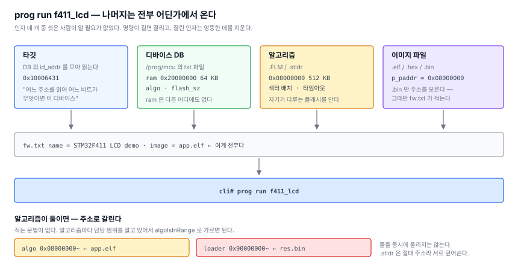

# 11. 인자 네 개를 하나로 — 디바이스 DB와 잡

> SWD 오프라인 다운로더 만들기 — [전체 목차](README.md)

[10편](10-stldr.md)까지 오면 굽는 건 다 된다. 그런데 명령이 이렇다.

```
cli# prog write /prog/loaders/st/0x431.stldr /prog/fw/f411_lcd/app.elf 0x20001000
```

**네 개 중 셋은 사람이 알 필요가 없는 것들이다.** 어느 알고리즘인지는 칩이
정하고, `0x20001000` 은 그 칩의 RAM 이고, 파일은 자기가 어디로 갈지 안다.

[7편](07-first-burn.md)에서 이 명령이 잘려 섹터 0 을 날렸다. 길이가 곧 위험이다.

---

## 1. ST 가 이미 만들어 뒀다

`STM32CubeProgrammer/Data_Base/` 에 `STM32_Prog_DB_0x431.xml` 같은 파일이 104개
있다. DEV_ID 로 색인되어 있고, 안에 우리가 손으로 적으려던 게 다 들어 있다.

```xml
<DeviceID>0x431</DeviceID>
<Name>STM32F411xC/E</Name>   <CPU>Cortex-M4</CPU>
<Peripheral><Name>Embedded SRAM</Name>
  <Parameters address="0x20000000" size="0x10000"/>
<Peripheral><Name>Embedded Flash</Name>
  <Parameters address="0x08000000" size="0x80000"/>
  <Field><Parameters address="0x08000000" name="sector0" occurrence="0x4" size="0x4000"/>
```

그리고 `bin/FlashLoader/0x431.stldr` 과 **파일명이 1:1로 맞는다.**

## 2. 그런데 ST 형식을 그대로 쓰지는 않는다

여기서 갈림길이 있었다. XML 을 그대로 SD 에 넣고 MCU 에서 읽을 것인가?

안 했다. 이유가 둘이다.

**하나. XML 파서가 필요하다.** 5.1MB 를 훑어야 하는데 정작 쓰는 값은 디바이스당
대여섯 개다.

**둘. 더 중요한 것 — 다른 제조사에는 이 DB 가 없다.** Nordic 도 NXP 도
CubeProgrammer Data_Base 를 배포하지 않는다. ST 형식을 채택하면 **다른 벤더가
손님이 된다.**

그래서 PC 에서 중립 형식으로 바꿔 넣는다. 5.1MB XML 이 18KB 텍스트가 된다.

```sh
./tools/python/cubedb2txt.py /opt/ST/.../STM32CubeProgrammer
  항목      : 103 개
  자동 판별 : 67 개
  로더 연결 : 99 개
```

```ini
[STM32F411xC/E]
cpu      = Cortex-M4
id_addr  = 0xE0042000        # 이 주소를 읽어서
id_mask  = 0x00000FFF        # 이 비트가
id_val   = 0x00000431        # 이 값이면 이 디바이스
ram      = 0x20000000        # 알고리즘을 올릴 자리
ram_sz   = 0x10000
flash    = 0x08000000
flash_sz = 0x80000
algo     = /prog/loaders/st/0x431.stldr
```

### `id_addr / id_mask / id_val` — 이 세 줄이 핵심이다

"어느 주소를 읽어 어느 비트가 무엇이면 이 디바이스" 라고만 적는다. ST 의
`DBGMCU` 든 Nordic 의 `FICR.INFO` 든 Microchip 의 `DSU.DID` 든 **같은 형식으로
쓰이고, 코드는 바뀌지 않는다.**

### `ram / ram_sz` — 이걸 얻으려고 DB 를 쓴다

`.FLM` 에도 `.stldr` 에도 **없는 유일한 값**이다. 알고리즘은 자기가 어느 플래시를
다루는지는 알지만 자기를 어디에 올려야 하는지는 모른다. 지금까지 `0x20001000` 을
손으로 치던 자리가 이것이다.

## 3. 어디를 읽을지 알려면 무슨 칩인지 알아야 한다

자동 판별에는 닭-달걀이 있다. ID 레지스터 주소가 패밀리마다 다르다 — ST 만 해도
F1/F2/F4/F7 은 `0xE0042000`, H7 은 `0x5C001000`, G0/C0/L0 은 `0x40015800` 이다.

해법은 단순하다. **DB 에 등장하는 서로 다른 `id_addr` 만 모아서 전부 읽어본다.**

```
1) DB 를 훑어 서로 다른 id_addr 를 모은다        F411 기준 3개뿐
2) 타깃에서 읽는다. 없는 주소는 FAULT 라 저절로 걸러진다
3) 다시 훑으며 (읽은값 & id_mask) == id_val 을 찾는다
```

후보가 몇 개뿐이라 읽기 서너 번이면 끝난다. **벤더가 늘어도 코드는 그대로**고
`id_addr` 종류만 늘어난다.

```
cli# prog dev
---- 103 개 (/prog/mcu)

타깃 판별 :
  읽은값 : 0x10006431
  이름   : STM32F411xC/E  (Cortex-M4)
  ram    : 0x20000000  64 KB
  flash  : 0x08000000  512 KB   (알고리즘과 교차 검증용)
  algo   : /prog/loaders/st/0x431.stldr
```

> 항목을 메모리에 쌓아두지 않고 그때그때 훑는다. 103개면 13KB 쯤 되는데 SD
> 읽기가 100ms 도 안 걸리는 일에 그만한 `.bss` 를 상시로 잡을 이유가 없다.
> 벤더가 늘어도 `.bss` 는 그대로다.

## 4. 다른 제조사는 CMSIS-Pack 에서

ST 아닌 칩은 `.FLM` 로 간다. 팩은 실은 ZIP 이라 풀면 되지만, 그러면 **어느 칩의
것인지와 RAM 주소가 빠진다.** RAM 주소는 `.FLM` 안에 없고 `.pdsc` 에만 있다.

```sh
./tools/python/pack2db.py GigaDevice.GD32H7xx_DFP.1.4.0.pack --list GD32H759
  GD32H759IG   Cortex-M7  ram 0x24000000  832 KB  GD32H7xx_1MB.FLM
  GD32H759II   Cortex-M7  ram 0x24000000  832 KB  GD32H7xx_2MB.FLM
  GD32H759IM   Cortex-M7  ram 0x24000000  832 KB  GD32H7xx_3840KB.FLM

./tools/python/pack2db.py <pack> GD32H759IG
  [+] assets/sd/prog/loaders/flm/GD32H7xx_1MB.FLM
  [+] assets/sd/prog/mcu/gigadevice.txt   ([GD32H759IG] 추가)
```

`.pdsc` 는 `family → subFamily → device` 로 속성이 상속되는데, 위 목록을 보면
모델마다 다른 `.FLM` 이 제대로 잡힌 걸 알 수 있다.

**"다른 제조사 지원은 DB 항목 추가만으로" 라는 설계 주장을 실제 팩으로 확인한
셈이다.** 펌웨어는 한 줄도 안 고쳤다.

> CMSIS-Pack 에는 디바이스 ID 레지스터 항목이 없다. 그래서 자동 판별은 안 되고
> `fw.txt` 에 이름을 적어야 한다. 알면 `--id-addr / --id-val` 로 넣을 수 있다.

## 5. 벤더 파일이 거짓말을 한다

추출한 `.FLM` 을 우리 파서로 열어보다 걸렸다.

```
Flash/GD32H7xx_1MB.FLM       GD32H7xx_3840kB   szDev 3840 KB  (8836 B)
Flash/GD32H7xx_2MB.FLM       GD32H7xx_3840kB   szDev 3840 KB  (8836 B)   ← 바이트까지 같다
Flash/GD32H7xx_3840KB.FLM    GD32H7xx_3840kB   szDev 3840 KB  (8844 B)
```

**1MB 용과 2MB 용이 같은 파일이고, 셋 다 자기를 3840KB 라고 소개한다.**

이게 왜 위험하냐면, [7편](07-first-burn.md)에서 섹터 0 을 날린 뒤에 넣은 범위
검사가 알고리즘의 자기 신고를 믿기 때문이다. 1MB 짜리 칩에서 `flmIsInRange` 가
3840KB 까지 통과시킨다.

그래서 DB 에 `flash / flash_sz` 를 따로 적어 **좁은 쪽을 택한다.**

```c
if (dev.flash_sz != 0 && algo.dev.sz_dev > dev.flash_sz)
{
  algo.dev.sz_dev = dev.flash_sz;      // 넓은 쪽을 믿지 않는다
}
```

출처가 하나뿐이면 그게 틀렸을 때 걸러낼 방법이 없다. 이건 계획에 "유도 가능한
것은 적지 않는다" 라고 써둔 원칙의 예외인데, **안전 검사는 중복이 목적**이다.

## 6. fw.txt — 두 줄이면 된다

```ini
name  = STM32F411 LCD demo
image = app.elf
```

`device` 를 안 적으면 판별하고, 알고리즘과 RAM 은 DB 에서 오고, 주소는 `.elf` 가
안다.

```
cli# prog run f411_lcd
잡     : STM32F411 LCD demo
device : (자동 판별)
image  : app.elf
----
ram    : 0x20000000
algo   : 0x08000000 ~ 0x0807FFFF
erase    : 0% 10% 21% 43% 87%
program  : 1% 12% 23% ... 100%
verify   : 1% 12% 23% ... 100%
----
run : OK  (7685 ms)
```

**인자가 프로젝트 이름 하나다.** 잘릴 길이가 아니다.

## 7. 외부 로더는 주소로 갈린다

내부 플래시와 외부 QSPI 를 같이 굽는 경우가 있다 — 부트로더는 내부에, 리소스는
외부에.

```ini
algo   = /prog/loaders/st/0x431.stldr             # 내부 플래시
loader = /prog/loaders/ext/MX25L512G_xx.stldr     # 외부 QSPI

image  = app.elf                                   # 0x08000000 -> algo
image  = res.bin @ 0x90000000                      # 0x90000000 -> loader
```

**어느 로더로 갈지 적는 문법이 없다.** 알고리즘마다 자기 담당 범위를 알고 있고
`algoIsInRange()` 는 [7편](07-first-burn.md)부터 있었다. 주소만 보면 갈린다.

### 둘을 동시에 올릴 수는 없다

여기서 제약이 하나 나왔다. `.stldr` 은 **절대 주소로 링크**되어 있다 — 내부용도
외부용도 `0x20000004` 부터다. 같이 올리면 서로 덮어쓴다.

그래서 이렇게 한다.

```
1. 알고리즘을 열기만 한다 (파일만 읽는다. 타깃은 안 건드린다)
2. 담당 범위를 얻어 이미지를 알고리즘별로 묶는다
3. 알고리즘 하나씩 — 리셋하고, 올리고, 담당분을 굽는다
```

매번 리셋하는 건 `ExternalLoader` 의 `Init()` 이 `SystemInit` 을 불러 **타깃
클럭을 재설정**하기 때문이다. FlashLoader 는 안 그런다.

```asm
Init:                          (ExternalLoader)
  bl  SystemInit               ← PLL 을 다시 잡는다
  bl  RCC_HCLKConfig
```

## 8. 정리 — 무엇이 어디서 오는가



| 값 | 출처 |
|---|---|
| 플래시 주소·크기·섹터 배치 | 알고리즘 (`.FLM` / `.stldr`) |
| 굽는 주소 | `.elf` 의 `p_paddr`, `.hex` 의 레코드, `.bin` 은 `fw.txt` |
| **알고리즘을 올릴 RAM** | **DB** — 다른 어디에도 없다 |
| 어느 알고리즘을 쓸지 | DB, 또는 `fw.txt` 가 덮어쓴다 |
| 무슨 칩인지 | 타깃에서 읽는다 |
| 플래시 크기 (교차 검증) | DB — 알고리즘 말과 대조한다 |

## 다음

계획서에서 남은 건 **LVGL 앱 하나**다. `prog run` 이 CLI 로 끝까지 도니, 앱은
그 표현 계층이 된다 — "GUI 는 맨 마지막" 이 지켜졌다.
