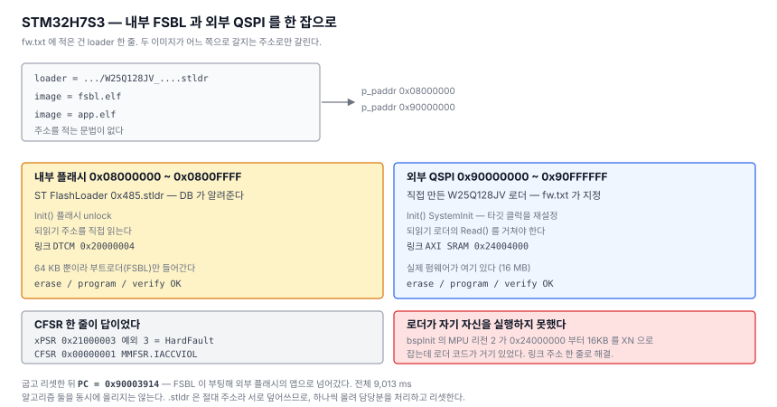

# 12. 외부 QSPI에 굽기 — 그리고 내가 나를 속인 이야기

> SWD 오프라인 다운로더 만들기 — [전체 목차](README.md)

[10편](10-stldr.md)에서 `.stldr` 을 붙였지만 외부 메모리는 시험하지 못했다.
QSPI 가 달린 타깃이 없었다. 이제 생겼다 — **STM32H7S3** 보드다.

이 칩은 내부 플래시가 64KB 뿐이라 부트로더(FSBL)만 들어가고 실제 펌웨어는
외부 QSPI(`0x90000000`)에 있다. 알고리즘이 둘 필요한, 딱 맞는 시험대다.

결론부터.

```
cli# prog run h7r_mini
algo   : 0x08000000 ~ 0x0800FFFF      <- ST FlashLoader (내부)
  erase / program / verify ...
algo   : 0x90000000 ~ 0x90FFFFFF      <- 직접 만든 W25Q128JV 로더 (외부)
  erase / program / verify ...
run : OK  (9013 ms)

cli# swd sysreset ; swd detach ; swd halt
PC = 0x90003914                       <- 외부 QSPI 에서 실행 중
```

거기까지 가는 데 걸린 것이 넷이었고, **그중 둘은 내 쪽 문제였다.**

---

## 1. 코어 디버그가 AP0 에 없다

연결은 됐는데 `swd core` 가 FAULT 였다.

```
cli# swd connect
DPIDR : 0x6BA02477   VERSION 2 (DPv2)      <- F411 은 DPv1 이었다
cli# swd md 0x08000000 2
08000000 : 00001003 00002002              <- 읽히긴 한다
cli# swd md 0xE000ED00 2
E000ED00 : FAULT                          <- 코어 디버그는 못 읽는다
```

Cortex-M3/M4 는 AP0 하나로 시스템 메모리도 PPB 도 다 닿아서 신경 쓸 일이
없었다. AP 를 훑는 명령을 만들어 보니 이 파트는 달랐다.

```
cli# swd apscan
AP   IDR         BASE        CLASS TYPE  CPUID
0    0x54770002  0xE00E0003  8     2     -
1    0x84770001  0xE00FE003  8     1     0x411FC272  <- 코어 디버그
```

AP0(AHB)은 **어느 주소를 읽어도 같은 값**을 돌려준다 — 연결되지 않은 버스다.
AP1(APB)이 메모리도 코어 디버그도 전부 닿는다.

ST-LINK gdbserver 를 `-m 1` 로 띄우는 것과 같은 이야기다. 그래서 **CPUID 가
ARM 값(`0x41______`)으로 읽히는 AP 를 찾는다.** DB 와 `fw.txt` 에 `ap` 로
강제할 수도 있다.

## 2. 그럼 CubeProgrammer 는 무엇으로 칩을 구분하나

[11편](11-device-db.md)에서 만든 자동 판별이 안 먹었다. DBGMCU 후보 주소를 전부
훑었는데 0 이거나 FAULT 였다.

```
0x5C001000 : 00000000      0x44002000 : FAULT
0xE0044000 : 00000000      0x40015800 : FAULT
0xE0042000 : 00000000      0x44024000 : FAULT
```

CubeProgrammer 의 DB 를 다시 봤다. **ID 를 읽을 주소가 아예 없다.** 파일명이
`STM32_Prog_DB_0x485.xml` 로 DEV_ID 일 뿐이다. 그럼 무엇으로 아는 걸까.

DPv2 를 의심했고 맞았다.

```
cli# swd dpwrite 0x8 0x2      (SELECT.DPBANKSEL = 2)
cli# swd dpread 0x4
DP[0x4] : 0x14850041
  TREVISION 0x1
  TPARTNO   0x4850   = DEV_ID 0x485 << 4
  TDESIGNER 0x020    = ST (JEP106)
```

**DPv2 의 `TARGETID` 에 파트 번호가 들어 있다.** 메모리도 AP 도 파워업도 안
거치고 DP 만 읽으면 된다. DB 에 주소가 없는 이유가 이걸로 설명된다.

DB 형식은 그대로 두고 `id_addr` 에 `0xFFFFFFFF` 센티널을 뒀다. "메모리가 아니라
TARGETID" 라는 뜻이고, 마스크·비교는 똑같으므로 **벤더별 인코딩(ST 는 4비트
왼쪽으로 민다)이 코드가 아니라 DB 에 남는다.**

DBGMCU 주소를 몰라 비워뒀던 37개 항목이 전부 자동 판별 대상이 됐다. 하필
그것들이 최신 파트라 DPv2 인 게 맞아떨어졌다.

```
cli# prog dev
  읽은값 : 0x14850041
  이름   : STM32H7RSxx  (Cortex-M7)
```

## 3. 외부 QSPI용 이미지가 내부 플래시로 갈 뻔했다

여기서 조용한 실패를 하나 만났다.

```
loader : .../W25Q128JV_STM32H7R-MINI.stldr
image  : app.elf                        (p_paddr = 0x90000000)
----
algo   : 0x08000000 ~ 0x0800FFFF        <- 내부?!
run : PROTOCOL
```

`app.elf` 는 `0x90000000` 인데 내부 플래시 알고리즘에 배정됐다. 원인은
**FatFs 의 `_FS_LOCK = 2`** — 파일을 두 개까지만 동시에 열 수 있다.

잡을 시작할 때 알고리즘 둘(내부·외부)을 열어 담당 범위를 읽는다. 그 상태에서
이미지를 열려니 **세 번째가 거부**됐고, 주소를 못 읽자 "기본값"으로 떨어졌다.
기본값은 첫 알고리즘의 시작 주소, 즉 `0x08000000` 이다.

지우기 직전까지 아무 경고도 없었다. [7편](07-first-burn.md)에서 잘린 인자로
섹터 0 을 날린 것과 성격이 같다 — **모르는 값을 조용히 그럴듯한 값으로 대체하면
가장 위험하다.**

알고리즘 파일은 이제 담당 범위만 읽고 바로 닫는다. 열어둘 이유도 없었고, 로더가
몇 개로 늘어도 동시에 열리는 건 알고리즘 하나 + 이미지 하나뿐이다.

## 4. 로더가 자기 자신을 실행하지 못했다

이제 로더가 제대로 선택되는데 `Init()` 이 0(실패)을 돌려줬다. 5밀리초 만에.

로더를 뜯어보면 `Init → hwInit → bspInit + ledInit + qspiInit` 이고
`qspiInit()` 이 실패한다. 속도를 388kHz 까지 낮춰도(링크 오류 0), 스택을 16KB 로
늘려도, 리셋을 빼도 똑같았다.

추측을 멈추고 **어디서 멈췄는지** 봤다.

```
cli# swd regs
PC   = 0x08002312          <- 로더가 아니라 FSBL 의 플래시 코드
xPSR = 0x21000003          <- 예외번호 3 = HardFault
cli# swd md 0xE000ED28 4
CFSR = 0x00000001          <- MMFSR.IACCVIOL (명령어 인출 접근 위반)
HFSR = 0x40000000          <- FORCED (MemManage 에서 승격)
```

**MPU 다.** 로더의 `bspInit()` 에 이런 리전이 있었다.

```c
MPU_InitStruct.Number      = MPU_REGION_NUMBER2;
MPU_InitStruct.BaseAddress = 0x24000000;
MPU_InitStruct.Size        = MPU_REGION_SIZE_16KB;
MPU_InitStruct.DisableExec = MPU_INSTRUCTION_ACCESS_DISABLE;   // XN
```

MPU 는 **번호가 큰 리전이 이긴다.** 리전 1 이 `0x24000000` 부터 512KB 를 실행
가능으로 잡아도, 리전 2 가 앞 16KB 를 실행 금지로 덮는다.

그리고 로더의 링커 스크립트가 이랬다.

```ld
RAM (xrw) : ORIGIN = 0x24000004,   LENGTH = 319K
```

**로더 코드가 바로 그 16KB 안에 있다.** `HAL_MPU_Enable()` 이 실행되는 순간
다음 명령어를 인출하다 폴트가 난다.

앱과 FSBL 에서는 그 자리가 `.non_cache` 버퍼고 코드는 `0x24004000` 부터라 문제가
없었다. 로더만 같은 `bspInit` 을 쓰면서 코드를 그 영역에 놓은 것이다.

```ld
RAM (xrw) : ORIGIN = 0x24004000,   LENGTH = 300K
```

한 줄 고치니 `Init : OK (5 ms)`, `Erase : OK (241 ms)`.

> 이건 우리 다운로더 버그가 아니다. 그런데 **우리 도구가 원인을 짚어줬다** —
> CFSR 한 줄이면 끝날 일을, 그게 없었으면 계속 QSPI 배선을 의심했을 것이다.

## 5. 외부 메모리는 되읽기가 안 된다

소거와 굽기가 통과했는데 검증에서 막혔다. 지운 자리를 읽으면 `0xFF` 여야 하는데
`0x00000000` 이 나왔다.

**외부 QSPI 는 memory-mapped 모드를 켜지 않으면 주소를 직접 못 읽는다.** 내부
플래시는 그냥 코어 주소 공간에 있지만 외부 메모리는 XSPI 컨트롤러가 중계한다.

`.stldr` 규약에 답이 있었다 — `Read(addr, size, buf)`.

```c
/* 알고리즘이 타깃 RAM 버퍼로 옮겨주면 우리는 그 버퍼를 SWD 로 읽는다. */
if (p_algo->ops->read != NULL && p_algo->dev.dev_type == ALGO_DEV_EXTERNAL)
{
  err = p_algo->ops->read(p_algo, addr + done, n, p_algo->buf_addr);
  if (err == SWD_OK) err = swdMemReadBlock(p_algo->buf_addr, rd, (n + 3) / 4);
}
else
{
  err = swdMemReadBlock(addr + done, rd, (n + 3) / 4);   // 내부는 직접
}
```

`.FLM` 은 `read` 가 NULL 이라 예전 경로 그대로다.

## 6. 그리고 내가 나를 속였다

4번을 쫓는 도중, 로더의 함수들을 하나씩 불러 봤다.

```
cli# swd exec 0x240008A8 ...     qspiHwInit  -> 0 (QSPI_OK)
cli# swd exec 0x24000C56 ...     qspiHwGetID -> 0 (QSPI_OK)
cli# swd exec 0x24000CAC ...     qspiInit    -> 1 (성공)
```

**개별로는 전부 성공한다.** 그래서 "첫 호출만 실패하는 타이밍 문제" 라고
결론짓고 한참 그쪽을 팠다. 틀렸다.

`swd exec` 의 아레나 배치가 이랬다.

```
ram_base + 0x000   BKPT 트램폴린      <- 스택이 자라 내려오는 방향
ram_base + 0x010   스택 바닥
ram_base + 0x810   스택 꼭대기 (SP)   <- 기본 2KB 고정
```

스택은 위에서 아래로 자란다. HAL 을 쓰는 함수가 2KB 를 넘기면 **BKPT 트램폴린을
덮어쓰고**, 그러면 `bx lr` 이 어디로 갈지 알 수 없다. 그 상태에서 읽은 `r0` 를
나는 "반환값" 으로 믿었다.

돌아보면 신호는 있었다. `Init()` 은 `int` 를 돌려주고 코드상 0 아니면 1 인데,
읽힌 값은 `0x0800AC70` — **플래시 주소**였다. 그때 이상하다고 여겼어야 했다.

고친 건 두 가지다. 스택 크기를 인자로 받게 했고, **스택 영역을 패턴으로 채워
호출 뒤 얼마나 썼는지 되읽는다.**

```
cli# swd exec <pc> <ram> 0 0 0 0 10000 0x8000
arena      : bkpt 0x24030000  stack 0x24030010 ~ 0x24038010 (32768 B)
stack 사용 : 32768 B  <- 모자라다!
```

"스택이 모자란가" 는 추측할 게 아니라 재면 되는 것이었다.

## 7. 정리 — 무엇이 어디서 갈리나



| | 내부 플래시 | 외부 QSPI |
|---|---|---|
| 알고리즘 | `st/0x485.stldr` (DB 가 알려줌) | `ext/W25Q128JV_....stldr` (`fw.txt`) |
| 주소 | `0x08000000` | `0x90000000` |
| `Init()` | 플래시 unlock | **`SystemInit` — 클럭을 재설정한다** |
| 되읽기 | 주소를 직접 | **로더의 `Read()` 를 거쳐야** |
| 링크 주소 | DTCM `0x20000004` | AXI SRAM `0x24004000` |

`fw.txt` 에 적은 건 `loader` 한 줄이다. **두 이미지가 어느 쪽으로 갈지는 주소로만
갈렸다** — 적을 문법이 없다.

```ini
name   = STM32H7R mini (FSBL + QSPI)
loader = /prog/loaders/ext/W25Q128JV_STM32H7R-MINI.stldr
image  = fsbl.elf      # p_paddr 0x08000000 -> 내부
image  = app.elf       # p_paddr 0x90000000 -> loader
psize  = 2
```

## 8. 되돌아보면

이번 편의 버그 넷 중 **둘은 도구 쪽, 둘은 대상 쪽**이었다.

- `_FS_LOCK` 과 `swd exec` 의 스택은 우리 문제였고, 둘 다 **조용히 그럴듯한
  값을 만들어내서** 위험했다.
- AP 와 MPU 는 대상 쪽이었고, 둘 다 **레지스터 한두 개를 읽으니 즉시** 답이
  나왔다 — `swd apscan` 과 `CFSR` 이다.

[8편](08-performance.md)에서 얻은 교훈이 그대로 반복됐다. **재고 나서 판단하는
것과 그럴듯한 이야기를 만드는 것은 다르다.** 이번엔 내가 만든 이야기를 내 도구가
뒷받침해줘서 더 오래 걸렸다.

## 다음

계획서에서 남은 건 **LVGL 앱 하나**다. `prog run` 이 내부·외부를 섞은 잡까지
CLI 로 끝까지 도니, 앱은 그 표현 계층이 된다.
