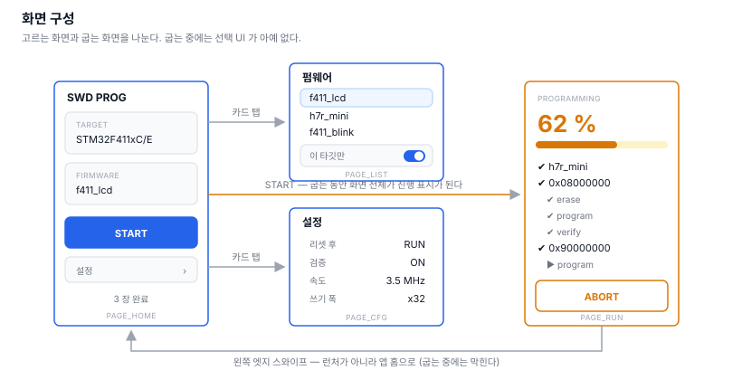
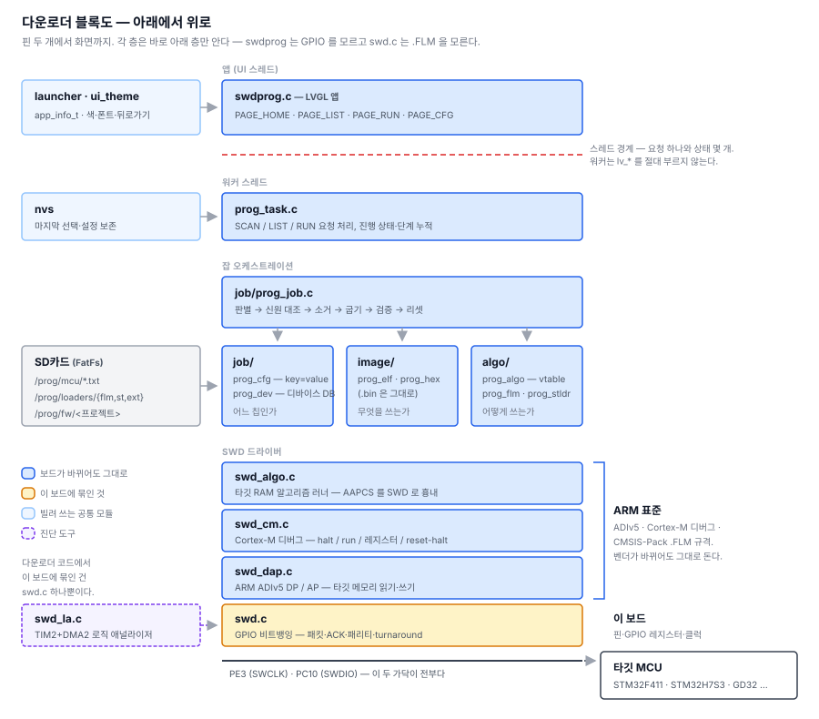

# 13. 화면을 붙이다 — 그리고 손으로 만져보니 드러난 것들

> SWD 오프라인 다운로더 만들기 — [전체 목차](README.md)

계획 첫 줄에 이렇게 적어뒀다.

> **핵심 전략: GUI는 맨 마지막.** 각 단계는 CLI 명령으로 독립 검증되고, 마지막
> GUI는 이미 동작하는 `prog run`의 표현 계층일 뿐이다.

지켰다. 앱에는 **굽는 로직이 한 줄도 없다.** 요청을 남기고 상태를 폴링해 그릴
뿐이다.

그런데 화면을 붙이고 **직접 손으로 만져보니** 버그가 열한 개 나왔다. 그중 대부분은
CLI 로는 영원히 안 보였을 것들이다.

---

## 1. 워커를 먼저 떼어낸다

굽기는 10초쯤 걸리고 그 안에서 SD 를 읽고 SWD 를 수천 번 두드린다. UI 스레드에서
부르면 그동안 화면이 통째로 멈춘다.

규칙을 둘로 정했다.

```
워커는 lv_* 를 절대 부르지 않는다.       LVGL 은 UI 스레드 것이다.
UI 는 blocking 을 하지 않는다.           SD 훑기도 워커가 한다.
```

접점은 요청 하나와 상태 몇 개뿐이다. `prog task` CLI 로 GUI 와 **같은 경로**를
두드릴 수 있게 해서, 화면을 안 보고도 워커를 시험할 수 있다.

## 2. 화면을 넷으로 나눈다

처음에는 한 화면에 다 넣었다. 굽는 중에도 선택 카드가 자리를 차지하는데 그때
보고 싶은 건 진행률과 단계다. 반대로 고를 때는 진행 카드가 빈 채로 자리만 먹는다.



실행 화면을 나누니 얻는 게 분명했다.

- 퍼센트를 **타이틀 폰트로** 쓸 수 있다
- 단계를 4줄이 아니라 **화면 가득** 보여줄 수 있다
- 굽는 중에는 선택 UI 가 **아예 없다.** 오조작이 구조적으로 막힌다 —
  그전에는 `LV_STATE_DISABLED` 로 막았는데 그건 규칙이지 구조가 아니다

## 3. 무엇에 쓰는 물건인지부터 정한다

"한 펌웨어를 여러 보드에 반복" 이 주 용도라고 보고 거기 맞췄다. 근거는 단순하다 —
**책상에서 개발 중이라면 이 장비를 쓸 이유가 없다.** PC 가 있고 ST-LINK 가 더
빠르다. 이 물건의 존재 이유는 PC 가 없는 곳이고, 그건 곧 반복 작업이다.

그래서:

- 고른 펌웨어를 **NVS 에 저장**한다. 전원을 껐다 켤 때마다 다시 고르게 하면 안 된다
- 완료 화면 버튼이 **"다시 굽기"** 다. 보드만 바꿔 끼면 된다
- **몇 장 했는지** 센다
- SCAN 버튼을 없앴다. 진입 시 자동 스캔 + 타깃 카드 탭이면 충분하고, 그만큼
  START 를 화면 폭으로 키울 수 있다

버튼 하나가 상태에 따라 `START` / `ABORT` / `다시 굽기` 로 바뀐다. 화면이 작을 때
버튼을 여러 개 두는 것보다 낫다.

## 4. 단계는 쌓기만 하고 지우지 않는다

처음엔 12줄 링버퍼였다. 지나간 단계가 사라지니 **실패했을 때 어디까지 갔었는지**를
못 본다. 그게 가장 알고 싶은 정보다.

48개 누적으로 바꾸고 단계마다 상태·소요시간·계층을 들게 했다.

```
✔ h7r_mini          0.0 s
✔ AP 1 선택
✔ 0x08000000        0.0 s
✔   erase           0.1 s
✔   program         0.3 s
✔   verify          3.3 s
✔ 0x90000000        0.0 s
✔   erase           0.5 s
▶   program         62 %
```

진행 중에는 맨 아래를 따라가고, 사람이 스크롤하면 멈춘다. 새로 생긴 줄만 붙인다 —
매번 다시 그리면 스크롤 위치가 튄다.

---

## 5. 만져보니 나온 것들

여기부터가 이 편의 본론이다. **CLI 로는 하나도 안 보였다.**

### 요청이 덮어써진다

앱에 들어가 펌웨어 목록을 열면 "fw.txt 가 없다" 가 나왔다. SD 에는 12개가 멀쩡히
있었다.

```c
progTaskList();   // prog_req = LIST
progTaskScan();   // prog_req = SCAN   ← LIST 가 사라진다
```

`prog_req` 가 단일 변수인데 워커는 5ms 마다 본다. 그 사이에 둘이 들어오면 앞엣것이
지워진다. **목록이 만들어진 적이 아예 없었다.** 비트마스크로 바꿨다.

### 화면 위 48px 은 누를 수 없다

닫기 버튼이 안 눌렸다. `ui_shade` 가 `lv_layer_top()` 에 **화면 폭 × 48px 센서**를
깔아둔다 — 상단 셰이드를 끌어내리는 감지 영역이다. 그 아래 깔린 것은 터치가 가지
않는다.

카세트 앱의 모달은 화면 중앙이라 이걸 만난 적이 없었다.

닫기를 아래로 옮기고 `HEAD_H` 를 `SHADE_H + 12` 로 **계산**하게 했다. 두 값을 따로
적으면 나중에 하나만 고쳤을 때 조용히 안 눌리는 버튼이 또 생긴다.

> 그러고도 필터 토글을 상단 우측에 뒀다가 같은 걸 또 만났다. 상수를 만들어 두는
> 것만으로는 부족하고, **누를 수 있는 건 전부 하단에** 라는 규칙이 필요했다.

### 스크롤했는데 선택된다

카세트 앱에서 가져온 가드가 이랬다.

```c
/* 릴리즈 지점이 눌렀던 항목 밖이면(드래그) 무시한다 */
if (p.x < a.x1 || p.x > a.x2 || p.y < a.y1 || p.y > a.y2) return;
```

**"행 밖에서 뗐나" 만 본다.** 그런데 스크롤은 대개 같은 행 안에서 손을 뗀다 —
행 높이가 68px 이고 스크롤 거리는 그보다 작을 때가 많다. 그대로 통과했다.

실제로 스크롤이 일어났는지를 물어야 했다.

```c
if (lv_indev_get_scroll_obj(indev) != NULL) return;   // 스크롤 중이었다

lv_indev_get_vect(indev, &vect);                       // 관성 없이 조금 끈 경우
if (vect.y > 4 || vect.y < -4) return;
```

여기서 잘못 고르면 **엉뚱한 펌웨어를 그대로 굽는다.** 안전 장치다.

### 깜빡임은 렌더링이 아니라 내용이었다

앱에 들어오면 화면이 한 번 깜빡였다. 처음엔 애니메이션과 겹친 프레임 드롭이라
보고 만드는 순서를 바꿨다. **효과가 없었다** — 런처는 화면을 오른쪽 밖에 만들고
`enter()` 를 부른 뒤에 밀어 넣으므로, 화면은 슬라이드 전에 이미 다 채워져 있다.

원인은 두 함수가 **시작할 때 결과 자리를 먼저 비운 것**이었다.

```c
progTaskDoScan()  →  memset(&target, 0, ...)     // 타깃이 "-" 로
progTaskDoList()  →  proj_cnt = 0                // 목록이 비어서
```

빈 상태를 한 번 그리고, 1초쯤 뒤 결과가 나오면 다시 채워진다. 임시 자리에
모았다가 **끝난 뒤 한 번에** 옮기도록 바꿨다. 연결이 끊긴 경우만 즉시 반영한다 —
그건 알려야 하는 변화다.

> 이걸 정확히 짚어준 건 화면을 본 사람이었다. "타깃과 펌웨어가 선택 안 된 상태가
> 잠깐 보이고 이후에 활성화되면서 깜빡임처럼 보인다" — 그 한 문장이 내가 두 번
> 헛짚은 것을 끝냈다.

### 못 누르는 버튼이 못 눌러 보이지 않는다

`LV_STATE_DISABLED` 를 걸고 있었는데 **테마에 비활성 스타일이 없었다.** 강조색
그대로인 버튼을 사람이 못 누른다고 생각할 리 없다. 앱이 아니라 테마 쪽 문제라
거기서 고쳤다.

그리고 비활성일 때 버튼 글자를 "펌웨어 선택" 으로 바꿨더니 **누르면 선택 화면이
열릴 것처럼** 보였다. 상태를 동작처럼 쓰면 안 된다. 글자는 언제나 `START` 로 두고
이유는 버튼 위 한 줄에 적는다.

### 폰트에 없는 글자

목록 구분자로 가운뎃점 `·`(U+00B7) 을 썼더니 깨져 보였다.

| 폰트 | 담고 있는 것 | U+00B7 |
|---|---|---|
| `montserrat_20` | ASCII + LVGL 심볼 | 없음 |
| `kr_20.bin` | ASCII + KS X 1001 **한글 영역만** | 없음 |

ASCII 로 바꿨다. 규칙은 **UI 문자열의 기호는 ASCII 이거나 `LV_SYMBOL_*`**.

### ABORT 가 아무 일도 안 한다

`prog_abort` 를 세우기만 하고 **아무도 보지 않았다.** 화면만 있고 배선이 없었다.

알고리즘 계층에 중단 훅을 두고 소거·굽기·검증 루프가 **조각 경계에서** 묻는다.
알고리즘 호출 도중에는 끊지 않는다 — 타깃이 플래시를 쓰는 중일 수 있다.

### 그리고 가장 중요한 것 — 신원 대조가 없었다

계획서에 이렇게 써뒀다.

> **지우기 직전에 실제 읽은 DEV_ID 와 DB 항목을 대조하고 불일치면 하드 스톱**한다.
> 엉뚱한 보드를 지우는 걸 막는 유일한 장치다.

**구현하지 않았다.** F411 을 물린 채 H7RS 용 잡을 돌리니 H7RS 알고리즘을 F411
RAM 에 올려 굽기 시작했다. `fw.txt` 가 `device` 를 적었더라도 타깃을 직접 읽어
대조하도록 고쳤다.

```
!! 물린 MCU 가 fw.txt 와 다르다
!! 실제 : STM32F411xC/E
```

> 이 버그를 찾은 경위도 남길 만하다. 실행이 실패하고 로그에 `AP 0 선택` 이
> 찍혀서 [12편](12-external-loader.md)의 AP 선택 로직을 의심했다. 한참 뒤
> `swd apscan` 을 돌려보니 CPUID 가 `0x410FC241` — **벤치의 보드가 F411 로
> 바뀌어 있었다.** AP 0 은 맞는 값이었다. 또 재기 전에 이야기를 만들었다.

### 뒤로가기가 앱을 통째로 나가버린다

굽기를 끝내고 왼쪽 엣지를 쓸면 직전 화면이 아니라 런처 홈으로 나갔다. 런처는
app 내부 페이지를 모르니 당연했다.

`app_info_t` 에 "처리했다/아니다" 만 돌려주는 훅을 뒀다. **두 번 틀렸다.**

첫 번째. 런처는 제스처 내내 손가락을 따라 app 컨테이너를 밀고 있다. 훅이
`true` 를 돌려주면 그대로 `return` 해서 **밀린 자리에 화면이 굳었다.** 절반 넘게
밀렸으면 홈으로 나간 것처럼, 덜 밀렸으면 멈춘 것처럼 보였다.

두 번째. 제자리로 되돌려 놓아도 **끄는 동안 뒤에 드러나는 건 여전히 런처 홈**
이었다. 이건 되돌리기로 고칠 수 있는 게 아니다 — 런처는 app 컨테이너밖에 못 미니
그 뒤에 있는 건 언제나 런처 홈이다.

```
런처가 미는 것     [ app 전체 ]  →  뒤에 런처 홈
app 이 밀어야 할 것 [ 실행 화면 ]  →  뒤에 app 홈
```

뒷장이 app 의 직전 페이지여야 한다면 **그건 app 만 그릴 수 있다.** 훅을
`MOVE / DONE / CANCEL` 3단계로 바꾸고 `dx` 를 같이 넘겼다. app 이 가져가면 런처는
컨테이너를 아예 건드리지 않는다.

그러고 나니 현재 페이지가 투명해 보였다. 페이지들을 `lv_obj_remove_style_all()`
로 만들어 **바탕이 없었다.** 겹쳐만 있을 때는 뒤에 같은 색 스크린이 깔려 티가 안
나다가, 밀리는 순간 뒤 페이지가 그대로 비쳤다.

> 두 번 다 **잘못된 계층에서 고치려 한 것**이었다. 증상은 "홈으로 간다" 하나인데
> 원인은 "누가 무엇을 밀 수 있느냐" 였다.

### 로고를 지운 뒤가 까만 화면

부팅 로고는 `lcdInit()` 에서 이미 그리고 있었다. 그런데 `uiInit()` 첫 줄이
`lcdLogoOff()` 였다 — 화면을 지우고 나서 SPI 플래시의 한글 폰트 두 개를 읽고
런처 화면을 다 만들 때까지가 전부 빈 화면이었다.

**지우지 않기만 하면 됐다.** 표시 계층이 DIRECT 모드라 LVGL 은 지금 표시중이
아닌 버퍼에 첫 프레임을 통째로 그린 뒤에 표시 주소를 바꾼다. 로고가 준비 끝나는
순간까지 떠 있다가 완성된 메뉴로 한 번에 넘어간다.

지우는 코드를 지워서 고친 유일한 버그다.

## 6. 한글이 40% 크게 나온다

LVGL 의 fallback 폰트는 **크기를 바꾸지 않는다.** 그 폰트가 가진 크기 그대로
그린다.

```
font_body    montserrat_28  +  kr.bin(28)     맞는다
font_caption montserrat_20  +  kr.bin(28)     한글만 40% 크다  ← 카드를 넘쳤다
```

역할마다 같은 크기의 한글 폰트가 필요했다. 공식 도구인 `lv_font_conv` 는 node 가
필요한데 없어서, LVGL 의 `lv_binfont_loader.c` 를 거꾸로 구현한
`tools/python/font_bin.py` 를 만들었다.

포맷을 맞추는 데 네 군데가 걸렸다. 전부 로더를 읽어야 알 수 있는 것들이다.

| 걸린 곳 | 내용 |
|---|---|
| `glyph_offset` | glyf 테이블 **시작(길이 필드) 기준**이라 라벨 8바이트를 포함한다 |
| `advance_width_format` | 0 이면 로더가 adv 에 **16 을 또 곱한다** |
| 헤더 비트수 | 8 의 배수가 아니면 `bmp_size` 계산이 한 바이트 어긋난다 |
| `tables_count` | 4 이상이면 **없는 kern 테이블**을 읽으려다 로드가 통째로 실패한다 |

마지막 것이 압권이었다. 주석에는 "kern 은 넣지 않는다" 라고 써놓고 값은 4 를
넣었다.

**공식 도구가 있으면 그걸 쓰는 게 맞다.** README 에 그렇게 적어뒀다 — 직접 만든
인코더는 node 가 없을 때의 비상용이다.

## 7. 되돌아보면

이 편의 버그 열하나 중 **아홉은 화면을 손으로 만져야만 보이는 것**이었다. CLI 로
`prog run` 은 완벽하게 돌고 있었다.

그리고 성격이 갈렸다.

- **조용히 그럴듯한 값을 만드는 것** — 요청 덮어쓰기, 내용 비우기, 좌표 가드.
  동작은 하는데 틀린 결과를 낸다. 이런 게 제일 위험하다
- **아예 없는 것** — ABORT 배선, 신원 대조, 비활성 스타일. 만들었다고 생각했는데
  안 만들었다
- **환경이 정한 것** — 셰이드 센서 48px, 폰트에 없는 글자, fallback 크기.
  알기 전에는 알 수 없고, 알고 나면 당연하다
- **계층을 잘못 짚은 것** — 뒤로가기. 증상 한 줄에 원인이 두 층 아래 있었다.
  같은 자리를 두 번 고치고 나서야 "누가 무엇을 밀 수 있느냐" 가 보였다

[8편](08-performance.md)부터 반복된 교훈이 여기서도 나왔다. **AP 0** 을 의심하며
쓴 시간이, 보드가 바뀐 걸 확인하는 데 걸린 30초보다 훨씬 길었다.

## 8. 전체 구조

여기까지 쌓은 것을 한 장으로 본다. 다운로더에 관계된 것만 담았다.



읽는 법은 세 가지다.

**아래에서 위로.** 핀 두 개에서 시작해 비트뱅잉 → ADIv5 DP/AP → Cortex-M 디버그
→ 알고리즘 러너까지가 드라이버고, 그 위에서 잡을 꾸리고 파일을 읽고 화면을
그린다. 각 층은 바로 아래 층만 안다 — `swdprog.c` 는 GPIO 레지스터를 모르고
`swd.c` 는 `.FLM` 을 모른다.

**노랑은 하나뿐이다.** 다운로더 코드에서 이 보드에 묶인 건 `swd.c` 의 핀과 GPIO
레지스터가 전부다. `swd_dap.c` / `swd_cm.c` / `swd_algo.c` 는 ARM 이 정한 규격
이고, 플래시를 굽는 절차 자체는 `.FLM` 파일 안에 들어있다. [1편](01-swd-transport.md)
부터 이걸 노리고 나눴다. [11편](11-device-db.md)에서 GigaDevice 팩을 넣었을 때
코드는 한 줄도 안 고치고 DB 항목과 `.FLM` 만 늘었다 — 다만 그 칩을 실제로 구워본
것은 아직 아니다. 설계 주장이 참인지는 물건이 손에 들어와야 판명된다.

**가로로 빌려 쓰는 것들.** 왼쪽이 다운로더가 만들지 않고 가져다 쓰는 것들이다.
SD카드(FatFs), 설정 보존(nvs), 그리고 `launcher` · `ui_theme`. `swdprog` 는
특별한 앱이 아니라 `cassette` · `sysinfo` 와 같은 `app_info_t` 로 등록된다.
이번 편에서 `app_info_t` 에 뒤로가기 훅이 는 것도 swdprog 만을 위한 게 아니라
**하위 화면을 가진 모든 앱**의 몫이다.

경계 하나가 유난히 얇다. **빨간 점선 — 스레드 경계다.** 위아래가 요청 하나와
상태 몇 개로만 이어져 있다. 이 선이 얇아서 GUI 없이 CLI 로 워커를 통째로 시험할
수 있었고, 반대로 [5장](#5-만져보니-나온-것들)의 첫 버그(요청 덮어쓰기)도 바로
이 선 위에서 났다.

## 다음

계획서의 Stage 0~10 이 전부 끝났다. 선 두 가닥으로 시작해서 화면에서 펌웨어를
고르고 굽는 데까지 왔다.
