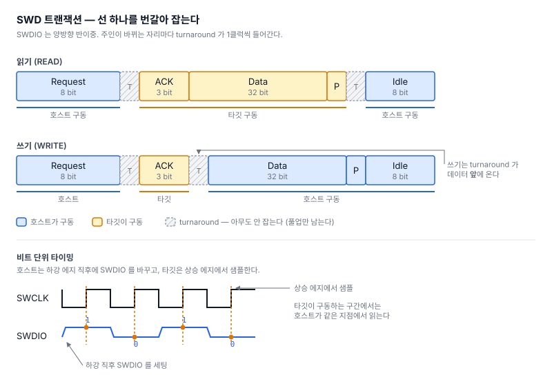

# STM32로 STM32를 굽는다 — SWD 오프라인 다운로더 만들기 (1)

PC도 ST-LINK도 없이, 보드 하나로 다른 MCU에 펌웨어를 굽는 장비를 만들고 있다.
SD카드에서 펌웨어를 골라 타깃에 쓰고 검증하는 것이 최종 목표다.

이번 글은 그 바닥 계층 — **선 두 가닥으로 남의 MCU를 들여다보는 것까지** 다룬다.

- 보드: STM32H723 (550MHz, 480×480 터치 LCD, LVGL)
- 타깃: STM32F411
- 배선: **SWCLK = PE3, SWDIO = PC10. 이게 전부다.**

---

## 1. SWD는 선 두 가닥이다

ARM Cortex-M을 디버깅할 때 쓰는 SWD(Serial Wire Debug)는 신호선이 둘뿐이다.

- **SWCLK** — 호스트가 만드는 클럭. 단방향
- **SWDIO** — 데이터. **양방향, 반이중**

핵심은 SWDIO가 양방향이라는 점이다. 한 트랜잭션 안에서 호스트와 타깃이 같은 선을
번갈아 잡는다.



요청 8비트는 `Start / APnDP / RnW / A2 / A3 / Parity / Stop / Park` 순서다.
ACK는 `OK=001`, `WAIT=010`, `FAULT=100`.

읽기와 쓰기의 **turnaround 위치가 다르다**는 점을 눈여겨볼 만하다. 읽기는 타깃이
데이터까지 다 보낸 뒤에 선을 넘겨주고, 쓰기는 ACK 직후에 넘겨받는다.

이 **turnaround** 때문에 구현 난이도가 결정된다. 트랜잭션 하나에 방향이 3~4번
바뀌고, 1MHz로 돌리면 초당 수만 번이다.

비트는 전부 **LSB first**로 나간다. 이게 나중에 버그를 하나 만든다.

---

## 2. GPIO로 파형 만들기 (비트뱅잉)

전용 하드웨어 없이 GPIO를 손으로 흔들어 파형을 만든다. 타이밍 규약은
ARM의 CMSIS-DAP 레퍼런스를 그대로 따랐다.

```c
// 쓰기: SWDIO 먼저 세팅하고 클럭을 친다
static inline void swdWriteBit(uint32_t bit)
{
  SWDIO_WR(bit & 1);
  SWCLK_LO(); swdDelay();
  SWCLK_HI(); swdDelay();   // 타깃은 상승 에지에서 샘플한다
}

// 읽기: 클럭이 low 인 동안, 상승 에지 직전에 샘플한다
static inline uint32_t swdReadBit(void)
{
  uint32_t bit;
  SWCLK_LO(); swdDelay();
  bit = SWDIO_RD();
  SWCLK_HI(); swdDelay();
  return bit;
}
```

### HAL을 못 쓰는 이유

`HAL_GPIO_WritePin()`은 호출당 수십 사이클이다. MHz급에서는 쓸 수 없어서
`BSRR`/`IDR` 레지스터를 직접 친다.

```c
#define SWCLK_HI()   (GPIOE->BSRR = (1UL << 3))
#define SWCLK_LO()   (GPIOE->BSRR = (1UL << (3 + 16)))   // 상위 16비트가 reset
#define SWDIO_RD()   ((GPIOC->IDR >> 10) & 1UL)
```

`BSRR`은 세트/리셋을 한 번의 쓰기로 처리하는 레지스터라 read-modify-write가
필요 없다.

### 방향 전환 — MODER 캐싱

SWDIO를 입력↔출력으로 바꾸려면 `MODER` 레지스터를 건드려야 하는데,
이게 **핀당 2비트씩 16개 핀이 한 워드에 들어있다.**

```
GPIOC->MODER   핀당 2비트 × 16핀 = 32비트
    PC10 → 비트 [21:20]    00=입력  01=출력
```

PC10만 바꾸려면 보통 read-modify-write를 한다:

```c
GPIOC->MODER = (GPIOC->MODER & ~(3<<20)) | (1<<20);   // 읽기+AND+OR+쓰기
```

문제가 둘이다. **느리고**(GPIO는 D3 도메인이라 읽기가 버스를 건너와 CPU가 멈춘다),
**안전하지 않다**(읽고 쓰는 사이에 다른 코드가 같은 포트의 다른 핀을 건드리면
그걸 덮어쓴다).

그래서 **16개 핀 전부의 올바른 상태가 이미 들어있는 워드 두 개를 미리 만들어 둔다.**
PC10 필드만 다르다.

```c
uint32_t m = GPIOC->MODER & ~(3<<20);   // 딱 한 번만 읽는다
moder_in  = m;                          // PC10 = 00, 나머지 15핀은 현재 그대로
moder_out = m | (1<<20);                // PC10 = 01

#define SWDIO_OUT()  (GPIOC->MODER = moder_out)   // 읽기 없는 단일 스토어
#define SWDIO_IN()   (GPIOC->MODER = moder_in)
```

방향 전환이 **원자적인 32비트 스토어 하나**가 된다. 인터럽트를 막을 필요도 없다.

> **여기서 실제로 한 번 물렸다.** 처음엔 이 캐시를 `swdInit()`에서 한 번만 만들었다.
> 그런데 `swdInit()`은 `hwInit()` 안에서 GPIO 초기화 직후에 돌고, 같은 포트를 쓰는
> SPI·SD·QSPI·LTDC 초기화는 **그 뒤에** 돈다. 낡은 워드를 그대로 쓰면 `SWDIO_OUT()`
> 한 번에 PC1(SD 클럭), PC6/7/9(LCD), PC11(QSPI)이 전부 초기화 이전 상태로 되돌아간다.
> SD·LCD·QSPI가 통째로 죽는 버그다. 지금은 SWD를 쓰기 직전마다 캐시를 갱신한다.
>
> Cortex-M7에는 비트 밴딩이 없어서(M3/M4 기능이고 ST의 M7 제품은 구현하지 않았다)
> 이 우회가 필요하다.

---

## 3. 계층 쌓기


**아래 한 층만 이 보드에 묶여 있고 나머지는 ARM 표준이다.** `swd.c`는 PE3/PC10과
STM32의 GPIO 레지스터를 직접 다루지만, 그 위의 DP/AP·디버그 코어·알고리즘 러너는
ARM이 정한 규격이라 ST든 Nordic이든 NXP든 같은 코드가 돈다.

이게 나중에 "다른 제조사 MCU 지원"이 거의 공짜가 되는 이유다. 벤더가 늘어도
바뀌는 건 디바이스 ID를 어디서 읽느냐 정도고, 플래시를 굽는 절차 자체는
`.FLM` 파일 안에 들어있다.

### 첫 성공 — DPIDR

링크가 붙었는지는 DP의 ID 레지스터를 읽어 확인한다.

```
cli# swd connect
DPIDR    : 0x2BA01477
  DESIGNER : 0x23B (ARM)
  VERSION  : 1 (DPv1)
  PARTNO   : 0xBA
connect  : OK (952 KHz)
```

`0x23B`는 ARM의 JEP106 코드다. 표준 Cortex-M3/M4용 SW-DP가 맞다.

### 함정 1 — AP 읽기는 posted 다

메모리를 읽으려면 MEM-AP의 `DRW` 레지스터를 읽는데, **요청한 자리에서 값이 나오지
않는다.** 다음 AP 읽기나 DP의 `RDBUFF`에서 나온다.

```
32비트 하나 읽기:
  CSW 설정 → TAR = 주소 → AP read DRW (버림) → DP read RDBUFF (진짜 값)
```

이걸 빠뜨리면 **모든 워드가 한 칸씩 밀린 채로 멀쩡해 보이는 값**이 나온다.
그래서 블록 읽기는 첫 결과를 버려 파이프라인을 채우고 마지막을 `RDBUFF`에서 받는다.
n워드에 n+1 트랜잭션이 든다.

### 함정 2 — 1KB 경계

TAR(주소 레지스터)의 자동 증가는 **1KB 경계에서 되감긴다.** 경계를 넘겨 블록 전송을
걸면 1KB마다 조용히 엉뚱한 주소를 읽거나 쓴다.

```c
while (count > 0)
{
  uint32_t room  = (0x400 - (addr & 0x3FF)) / 4;   // 경계까지 남은 워드
  uint32_t chunk = (count < room) ? count : room;
  ...
}
```

증상이 "플래시가 가끔 이상하다"로 나타나서 원인을 찾기가 가장 나쁜 부류다.
검증용 명령을 따로 만들어 1KB 경계를 세 번 걸치는 3KB를 쓰고 되읽어 비교한다.

```
cli# swd tartest 0x20010000
tartest : 2000FE00 ~ 200109FC (768 word), mismatch 0 -> PASS
```

### 메모리가 읽힌다

```
cli# swd md 0x08000000 4
08000000 : 20020000 08033E71 08033D65 08033D67
```

첫 워드 `0x20020000`은 SRAM 최상단 = **초기 스택 포인터**, 둘째 `0x08033E71`은
bit0이 선 플래시 주소 = **Thumb 모드 리셋 핸들러**. 교과서적인 벡터 테이블이다.
이게 보이면 MEM-AP는 확정이다.

---

## 4. nRST 없이 리셋해서 세우기

선을 두 가닥만 뽑았기 때문에 하드웨어 리셋 핀이 없다. 대신 Cortex-M의 디버그
기능만으로 처리한다.

```c
DEMCR = TRCENA | VC_CORERESET;      // "리셋 벡터에서 잡아라"
AIRCR = 0x05FA0000 | SYSRESETREQ;   // 소프트웨어 리셋 (0x05FA는 키)
// → S_HALT 될 때까지 폴링
```

`VC_CORERESET`은 벡터 캐치다. 리셋 직후 첫 명령을 실행하기 전에 코어를 세운다.

```
cli# swd rsthalt
rsthalt  : OK
halt at  : PC 0x08033E70  SP 0x20020000
reason   : VCATCH (reset vector catch)
```

PC가 `0x08033E70` — 아까 벡터 테이블에서 본 리셋 핸들러 `0x08033E71`에서 Thumb
비트만 뺀 값이다. SP도 벡터 테이블의 초기값과 정확히 일치한다.

한 가지 주의할 게 있다. **`SYSRESETREQ`가 디버그 로직까지 리셋해버리는 패밀리가
있다.** 그러면 폴링 도중 링크가 끊긴다. 그래서 처음부터 "끊기면 다시 붙이고 계속
기다린다"로 짰다. 나중에 패치할 성질이 아니다.

---

## 5. 하이라이트 — 보드에 로직 애널라이저를 넣다

여기부터가 이번 작업에서 제일 배운 게 많은 부분이다.

### 증상

단일 워드 읽기는 잘 되는데 **32워드 블록 읽기가 10번 중 7~9번 실패**했다.
에러는 `ACK = 111` — 타깃이 아예 응답하지 않는다는 뜻이다.

간헐적이고, 재현이 들쭉날쭉하고, 콘솔로는 아무것도 알 수 없었다. SWD 실패는
전부 `0xFFFFFFFF` 하나로 수렴하기 때문이다.

### 그래서 파형을 봤다 — 외장 장비 없이

SWCLK/SWDIO 두 핀에는 타이머 대체기능이 없다. 있었어도 비트뱅잉 중에는 핀이
GPIO 출력이라 타이머 입력 경로가 끊긴다. **입력 캡처를 못 쓴다.**

대신 **타이머 + DMA로 GPIO 입력 레지스터를 통째로 주기 샘플링**했다.

```
TIM2 (21 MSPS)
  ├─ TIM2_UP  → DMA2_Stream0 : GPIOE->IDR → 버퍼   (SWCLK)
  └─ TIM2_CH1 → DMA2_Stream1 : GPIOC->IDR → 버퍼   (SWDIO)
```

버퍼는 이 보드에서 **아무도 안 쓰던 RAM_D2 32KB**에 넣었다. 대체기능이 필요 없고,
덤으로 두 선을 동시에 본다.

여기에 SWD 프로토콜 디코더를 붙였다.

```
cli# swd la connect
cli# swd la decode
     3us  line reset : SWDIO=1, 57 clk  OK
    65us  jtag2swd   : 0xE79E  OK
    82us  line reset : SWDIO=1, 56 clk  OK
   140us  idle       : SWDIO=0, 8 clk
   149us  request    : 0xA5  DP RD A=0x0  par=1 park=1
            ack        : 100 = OK
            data       : 0x2BA01477  par=0
   201us  idle       : SWDIO=0, 8 clk
```

비트 수까지 정확히 맞는다: 57 + 16 + 56 + 8 + (8+1+3+32+1+1) + 8 = **191비트**.

> **디코더를 만들자마자 디코더 버그를 잡았다.** 처음엔 JTAG→SWD 전환 매직값
> `0xE79E`를 못 찾고 이후 프레임이 전부 깨졌다. 이유는 **`0xE79E`의 LSB가 0**이라서다.
> LSB first 전송이니 첫 비트가 `0`인데, 내 디코더는 "비트가 1이면 매직 확인"
> 구조였다. 한 비트가 밀리면서 그 뒤가 전부 쓰레기가 됐다.
>
> `swd connect`는 그동안 **계속 성공하고 있었다.** 파형을 안 봤으면 디코더가
> 틀렸다는 사실 자체를 몰랐을 것이다.

### 진범

디코더로 실패 순간을 잡아보니 **요청 바이트는 선에서 정상**인데 타깃이 응답을
안 했다. ADIv5 스펙상 **DP는 요청 패리티가 틀리면 아예 응답하지 않는다.**
즉 우리 핀에서는 멀쩡히 나갔는데 타깃에는 깨져서 도착했다는 뜻이다.

그럼 신호 무결성인데 — **클럭을 20배 낮춰도 실패율이 별로 안 떨어졌다.**
단순 정착 시간 문제라면 100kHz에서 사라져야 한다.

주기가 아니라 **에지**에 의존한다는 뜻이다. 그리고 원인은 내가 만든 것이었다.
계획 단계에서 "GPIO 출력을 VERY_HIGH로 올려야 파형이 안 뭉개진다"고 적어놨는데,
그건 **짧고 종단된 배선** 얘기였다. H7의 VERY_HIGH는 서브나노초 에지다.
종단 없는 점퍼선에서는 링잉과 반사를 만든다.

드라이브 강도만 런타임에 바꿔가며 재봤다.

| 출력 드라이브 | 32워드 읽기 20회 중 실패 |
|---|---|
| **LOW** | **0** |
| MEDIUM | 3 |
| HIGH | 11 |
| VERY_HIGH | 9 |

깔끔하게 비례한다. 클럭 속도와는 거의 무관하고 **에지에만** 의존한다.

```
cli# swd bench 0x20000000 32
read 32 KB in 41 ms -> 780 KB/s
```

처음 계획서에 적었던 예상치(1MHz에서 74 KB/s)의 10배다.

> **여기서 한 번 더 속았다.** LOW로 바꾼 직후 "최대 속도까지 무오류"라고 판단했는데,
> 그 테스트는 64워드(65 트랜잭션)짜리였다. 나중에 32KB(약 8200 트랜잭션)로 돌려보니
> 최대 속도에서는 5번 중 3번 실패했다.
>
> | 실측 클럭 | 32KB 전송 5회 |
> |---|---|
> | 1.8 MHz | 5/5 |
> | 3.5 MHz | 5/5 |
> | 5.7 MHz | 3/5 |
> | 23 MHz | 2/5 |
>
> 트랜잭션당 오류율이 아주 낮아도 수천 번 반복하면 반드시 드러난다.
> **짧은 테스트로 "괜찮다"고 결론 내리면 안 된다.** 이 배선의 실용 상한은 ~3.5MHz다.

제대로 하려면 **SWCLK/SWDIO에 직렬 22~33Ω, SWDIO에 풀업 10kΩ, 짧은 GND 리턴**이
맞다. 실제 디버그 프로브들이 다 그렇게 되어 있다. 지금은 배선을 못 고치니
소프트웨어로 에지를 죽인 셈이다.

### 배운 것

- **"빠르게"가 항상 좋은 게 아니다.** GPIO 드라이브 강도는 배선에 맞춰야 한다.
- **속도를 낮춰도 안 고쳐지는 신호 문제가 있다.** 주기 의존인지 에지 의존인지
  구분해야 원인이 보인다.
- **관측 수단을 먼저 만드는 게 이득이다.** 반나절 들여 만든 내장 로직 애널라이저가
  없었으면 이 문제를 훨씬 오래 붙잡고 있었을 것이다. 실패한 트랜잭션의 파형이
  버퍼에 남도록 순환 모드로 돌려두면, 100번에 1번 깨지는 현상도 그 순간을 잡을 수 있다.

---

## 6. 지금까지

선 두 가닥으로 여기까지 왔다.

```
cli# swd core
CPUID    : 0x410FC241  ARM Cortex-M4 r0p1
DEV ID   : 0x10006431 @ 0xE0042000
           dev_id 0x431  ST DBGMCU
```

- SWD 링크 성립, 최대 속도까지 무오류
- 타깃 메모리 읽기·쓰기, 780 KB/s
- 코어 halt / run / 싱글스텝 / 레지스터 읽기·쓰기
- nRST 없이 리셋 벡터에서 정확히 정지
- 파형을 직접 보고 프로토콜을 디코드하는 내장 도구

## 7. 타깃 RAM에서 코드 실행시키기

플래시를 굽는 알고리즘은 결국 **타깃 자신의 RAM에서 돌아야 한다.** 그래서 다음
단계는 "남의 MCU에서 내가 올린 함수를 호출하는 것"이 된다. C 함수 호출 규약을
SWD로 흉내 내는 셈이다.

```
R0~R3   = 인자
R9      = static base (RWPI 알고리즘용)
SP      = 아레나 스택 최상단 (8바이트 정렬)
LR      = BKPT 트램폴린 주소 | 1      ← Thumb 비트를 세운다
PC      = 함수 진입점 & ~1            ← Thumb 비트를 지운다
xPSR    = 0x01000000                 ← T 비트
→ 실행 → BKPT 에서 정지 → R0 를 거둔다
```

**LR은 비트0을 세우고 PC는 지운다.** 이 비대칭이 헷갈리는데, LR은 분기 대상이라
bit0이 Thumb 상태를 뜻하고 PC는 그 역할을 xPSR의 T 비트가 대신하기 때문이다.
LR의 비트를 빠뜨리면 `bx lr`로 돌아올 때 ARM 모드로 해석돼 트램폴린에 도달하지
못하고 전부 타임아웃으로 끝난다.

### ELF를 건드리기 전에 엔진부터 검증한다

여기서 바로 `.FLM` 파일을 파싱하기 시작하면, 나중에 실패했을 때 **ELF 파서가
틀렸는지 실행 엔진이 틀렸는지 구분할 수 없다.** 그래서 파일도 파서도 필요 없는
**손으로 짠 4바이트 기계어 세 개**로 엔진만 먼저 검증했다.

| 블롭 | 코드 | 확인하는 것 |
|---|---|---|
| `0xBE001840` | `adds r0,r0,r1` / `bkpt #0` | 레지스터 세팅 → 실행 → 정지 → 반환값 |
| `0x47701840` | `adds r0,r0,r1` / `bx lr` | 실제 알고리즘과 같은 복귀 경로 |
| `0xE7FEE7FE` | `b .` (무한루프) | 타임아웃과 강제 정지 |

```
cli# swd test alu 3 4
result   : OK (5 ms)
r0       : 7  ->  PASS

cli# swd test lr 10 32
result   : OK (6 ms)
r0       : 42  ->  PASS

cli# swd test to
result   : WAIT (204 ms)
           PASS (타임아웃 후 강제 정지)
```

세 개 다 한 번에 통과했다. 정지 직후 레지스터를 보면 의도가 그대로 찍힌다.

```
cli# swd regs
SP = 20001810     아레나 스택 최상단
LR = 20001001     BKPT 트램폴린 | 1   ← Thumb 비트
PC = 20001010     코드 진입점
xPSR=01000000 (T=1)
```

**A는 되는데 B가 안 되면 LR의 Thumb 비트, 둘 다 안 되는데 `swd regs`는 정상이면
xPSR의 T 비트** — 이렇게 원인이 바로 갈리도록 설계해뒀는데, 다행히 쓸 일이 없었다.

이제 진짜 알고리즘을 올릴 차례다. ARM의 CMSIS-Pack 표준 플래시 알고리즘(`.FLM`)과
ST의 External Loader(`.stldr`)를 SD카드에서 읽어 그대로 쓰는 것이 목표다. 둘 다
ELF 파일이라 파서를 공유하지만, 다루는 규칙이 미묘하게 다르다.

| | `.FLM` | `.stldr` |
|---|---|---|
| 링크 주소 | ROPI, 어디든 재배치 | **고정, 파일이 지정한 주소 그대로** |
| 성공 반환값 | `0` | `1` |
| 섹터 배열 | `(크기, 오프셋)` | `(개수, 크기)` |

둘을 뒤바꾸면 `Init()` 안에서 하드폴트가 나는데 아무 진단도 안 나온다.
성공 코드 극성은 호출부에 두지 않고 vtable에 숨기기로 했다.
